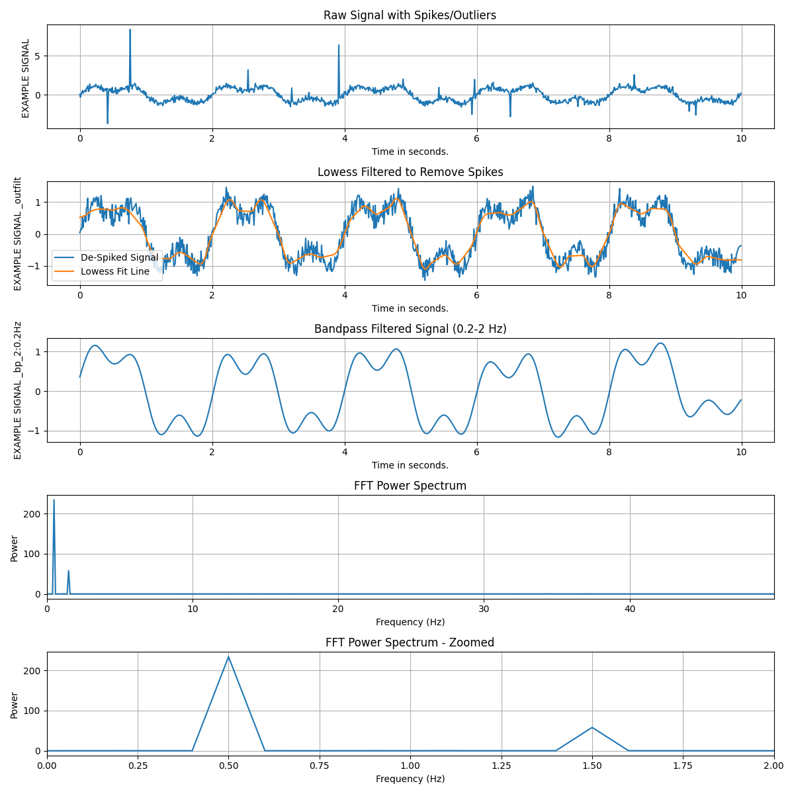
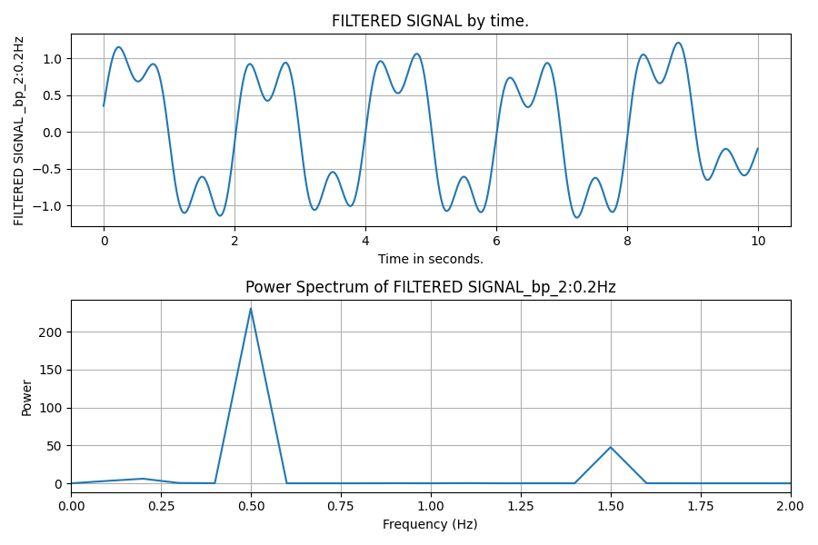

# baseTs

A Python library for time series analysis, focusing on filtering, outlier detection, and data processing.

## Features

- Time series filtering (lowpass, highpass, bandpass, Butterworth, Savitzky-Golay)
- Outlier detection using LOWESS (Locally Weighted Scatterplot Smoothing)
- Interpolation of missing values and resampling to uniform time grids
- FFT power spectrum analysis
- Data normalization and standardization
- Peak detection
- Visualization tools

## Installation

```bash
# Clone the repository
git clone https://github.com/YourUsername/baseTs.git
cd baseTs

# Install dependencies
pip install numpy scipy pandas matplotlib
```

## Usage
### Stepwise
```python
import numpy as np
import matplotlib.pyplot as plt
from baseTs import baseTs

# Create some synthetic data
n_points = 1000
t = np.linspace(0, 10, n_points)
# Signal with multiple frequency components and noise
signal = (
    np.sin(2 * np.pi * 0.5 * t) +          # 0.5 Hz component
    0.5 * np.sin(2 * np.pi * 1.5 * t) +     # 1.5 Hz component
    0.2 * np.random.randn(n_points)         # Noise
)

# Add some outliers
outlier_indices = np.random.choice(range(n_points), size=20, replace=False)
signal[outlier_indices] += 3 * np.random.randn(len(outlier_indices))

# Create baseTs object
ts = baseTs(signal, t, signal_name="Example Signal")

# Plot the raw signal
plt.figure(figsize=(12, 12))
ax = plt.subplot(5, 1, 1)
ts.plot(show=False, ax=ax)
plt.title("Raw Signal with Spikes/Outliers")

# Remove outliers using LOWESS
ts_filtered = ts.set_outlier_filter(frac=0.07, z_threshold=3).filter_outliers()

# Plot the filtered signal
ax = plt.subplot(5, 1, 2)
ts_filtered.plot(show=False, lowess=True, ax=ax)
plt.title("Lowess Filtered to Remove Spikes")
plt.legend(["De-Spiked Signal", "Lowess Fit Line"])
                 
# Apply bandpass filter
ts_bandpass = ts_filtered.bandpass_at(hp_hz=0.2, lp_hz=2)

# Plot the bandpass filtered signal
ax = plt.subplot(5, 1, 3)
ts_bandpass.plot(show=False, ax=ax)
plt.title("Bandpass Filtered Signal (0.2-2 Hz)")

# Plot FFT power spectrum
ax = plt.subplot(5, 1, 4)
ts_filtered.plot_fft_power(show=False, ax=ax)
plt.title("FFT Power Spectrum")

# Plot Zoomed FFT power spectrum
ax = plt.subplot(5, 1, 5)
ts_filtered.plot_fft_power(show=False, max_rate=2, ax=ax)
plt.title("FFT Power Spectrum - Zoomed")

plt.tight_layout()
plt.savefig("baseTs_example.png")

plt.show()
```


### We can also chain filters/transforms
```python
fig, ax = plt.subplots(2,1,figsize=(9,6))
filt = baseTs(signal, t, signal_name="Filtered Signal")\
            .set_outlier_filter(frac=0.07, z_threshold=3)\
            .filter_outliers().bandpass_at(hp_hz=0.2, lp_hz=2)

filt.plot(ax=ax[0], show=False)
filt.plot_fft_power(ax=ax[1], max_rate=2, show=False)
fig.tight_layout()
```


## Documentation

See the [CLAUDE.md](CLAUDE.md) file for development guidelines and code style.

## Requirements

- Python 3.6+
- NumPy
- SciPy
- Pandas
- Matplotlib

## License

MIT
