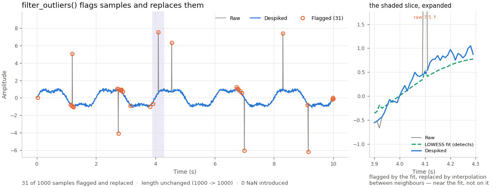
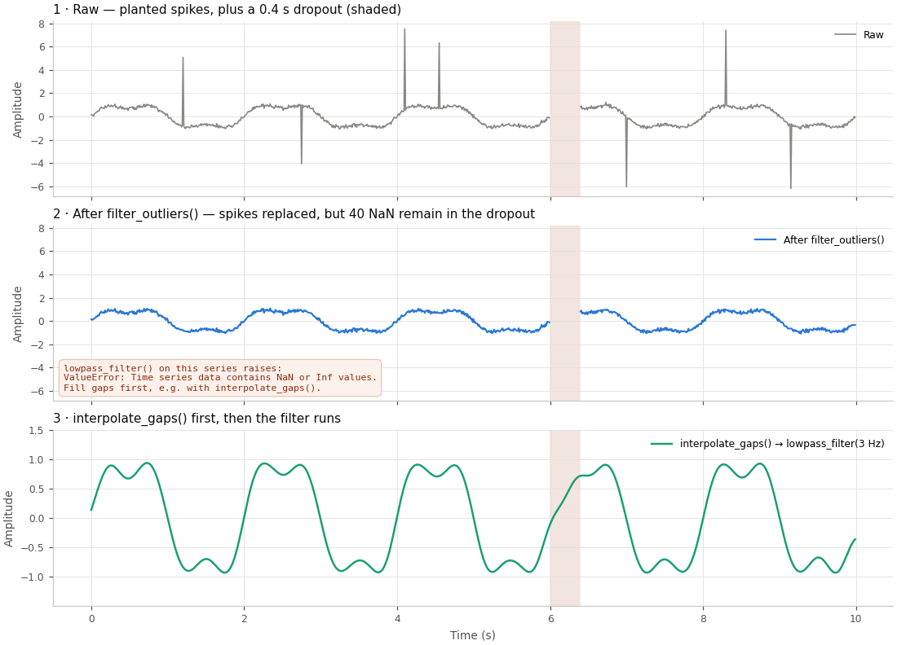

# baseTs

A powerful Python library for time series analysis built on pandas Series, providing advanced time-series processing capabilities with full backward compatibility.

## Features

### ⭐ **LOWESS Outlier Detection & Despiking**
- **Advanced LOWESS Filtering**: Robust spike artifact removal (the original motivation for this library!)
- **Configurable Parameters**: Z-threshold, fraction, iterations, and tail processing options
- **Quality Control**: Built-in QC plotting to visualize outlier detection results
- **Iterative Processing**: Multiple passes for thorough artifact removal



The LOWESS fit *detects* the outlier; the flagged sample is then replaced by
linear interpolation between its neighbours — landing near the fit, not on it,
and never dropped. Regenerate with `python examples/figures.py`.

### 🎛️ **Comprehensive Signal Processing**
- **Digital Filters**: Low-pass, high-pass, bandpass, notch, and Gaussian filtering
- **Advanced Filtering**: Butterworth, Savitzky-Golay, and custom filter implementations
- **Detrending**: Linear and constant detrending methods
- **Normalization**: Z-score, range normalization, and centering functions

### 🔗 **Time-Series Alignment & Synchronization**
- **Multi-Series Alignment**: `align_with()` for synchronizing different time series
- **Flexible Join Methods**: Inner, outer, left, and right alignment strategies
- **Exact-Timestamp Matching**: `align_with()` matches labels exactly, like `pandas.Series.align` — series on different time grids need `interp_to_uniform_grid()` first (see Quick Start)
- **Cross-Correlation**: Built-in correlation analysis between aligned series

### ⚙️ **Arbitrary Function Application**
- **Flexible Processing**: Apply any custom function via `.apply_function()`
- **Mathematical Operations**: Built-in support for complex transformations
- **Function Chaining**: Seamless integration with method chaining workflows
- **Custom Analytics**: Easy integration of domain-specific processing functions

### 📊 **Native Plotting Integration**
- **Direct Plotting**: `ax = ts.plot()` for immediate visualization
- **Multi-Series Plots**: `ts2.plot(ax=ax)` for overlay plotting
- **Specialized Plots**: FFT power spectra, histograms, lag plots, and QC visualizations
- **Matplotlib Integration**: Full compatibility with matplotlib workflows

### 🧮 **First-Class Mathematical Operations**
- **Natural Arithmetic**: `ts3 = ts1 + ts2`, `ts_scaled = ts * 2.5`
- **Element-wise Operations**: Addition, subtraction, multiplication, and division
- **Broadcasting Support**: Operations between series and scalars
- **Mathematical Functions**: Direct application of numpy/scipy functions

### 🐼 **Full Pandas Ecosystem Integration**
- **Native pandas Series**: Access to ~200 pandas Series methods, plus ~70 baseTs-specific ones — ~270 methods in total
- **NumPy Compatibility**: Seamless integration with NumPy functions and operations
- **SciPy Integration**: Direct compatibility with SciPy signal processing and statistics
- **Visualization Libraries**: Works with matplotlib, seaborn, plotly, and other plotting tools

### 🏗️ **Enhanced Architecture**
- **Pandas Series Foundation**: Built directly on pandas Series for optimal performance
- **100% Backward Compatibility**: All existing baseTs code works unchanged
- **Metadata Preservation**: Complete processing history and filter state tracking
- **Memory Efficiency**: Optimized storage without dual array overhead

### 🧬 **Multi-Channel Containers with `baseDf`**
- **Many Series, One Index**: `baseDf` holds channels, ROIs, or electrodes as columns of one table sharing a single time index
- **Broadcast Everything**: Any `baseTs` transform or measurement (filters, `falff`, `get_peak_freq`, ...) runs across every column at once
- **Label-Aware Selection**: Index by label, list, boolean mask, or a `col_meta` query string (`frame.select(where="network == 'DMN'")`)
- **Grouped Reduction**: `average()` and `average_by()` collapse selected or grouped columns, carrying metadata forward honestly

## Installation

```bash
# Install straight from GitHub
pip install git+https://github.com/SympatiCog/baseTs

# With parquet support (from_parquet needs pyarrow; a plain install skips it)
pip install "baseTs[parquet] @ git+https://github.com/SympatiCog/baseTs"

# Or install from a local clone
git clone https://github.com/SympatiCog/baseTs.git
cd baseTs
pip install -e ".[parquet]"

# For development (tests, linters, and pyarrow)
pip install -e ".[dev]"
```

Parquet is an optional extra: `from_csv` works everywhere, but `from_parquet`
raises pandas' "Unable to find a usable engine" until `pyarrow` is installed.

## Quick Start

### Basic Usage with Key Features
```python
import numpy as np
import matplotlib.pyplot as plt
from baseTs import baseTs

# Create sample data with artificial spikes. Use an exact grid (arange, not
# linspace) so a declared freq matches the true rate - see Requirements.
times = np.arange(1000) / 100.0
data = np.sin(2*np.pi*0.5*times) + 0.1*np.random.randn(1000)
# Add some spike artifacts
data[200] += 5.0  # Spike artifact
data[600] -= 4.0  # Another spike

# Create baseTs object
ts = baseTs(data=data, times=times, freq=100.0, signal_name="example")

# LOWESS outlier detection and despiking (library's signature feature!)
# filter_outliers() REPLACES outliers in place - it interpolates over them,
# it does not drop them, so length and index are unchanged. Use
# remove_outliers() instead if you want points dropped.
despiked = ts.set_outlier_filter(z_threshold=3.0).filter_outliers()

# Signal processing chain. filter_outliers() only fills the gaps it creates -
# a real acquisition dropout (pre-existing NaN) is left as NaN, and the
# filters below raise on non-finite input. Run interpolate_gaps() first if
# your data has gaps: despiked.interpolate_gaps().lowpass_filter(...).
processed = (despiked
             .lowpass_filter(cutoff=2.0)
             .detrend(method='linear')
             .zscale())

# Mathematical operations
ts_doubled = processed * 2.0
ts_combined = ts + processed  # First-class arithmetic

# Native plotting
ax = ts.plot()                    # Original signal
despiked.plot(ax=ax)             # Overlay despiked
processed.plot(ax=ax)            # Overlay processed
plt.legend(['Original', 'Despiked', 'Processed'])
plt.show()

n_repaired = int((np.asarray(ts) != np.asarray(despiked)).sum())
print(f"Repaired {n_repaired} of {len(ts)} points (length unchanged)")
print(f"Final stats: mean={np.mean(processed.data):.3f}, std={np.std(processed.data):.3f}")
```

### Pandas Integration & Advanced Features

```python
import numpy as np
from baseTs import baseTs

# Create two time series on different time grids
times1 = np.arange(10000) / 100.0        # 0.00 .. 99.99s @ 100 Hz
times2 = np.arange(9900) / 100.0 + 0.5   # 0.50 .. 99.49s @ 100 Hz, offset start
data1 = np.sin(2*np.pi*0.5*times1) + 0.1*np.random.randn(10000)
data2 = np.cos(2*np.pi*0.5*times2) + 0.1*np.random.randn(9900)

ts1 = baseTs(data=data1, times=times1, freq=100.0, signal_name="signal1")
ts2 = baseTs(data=data2, times=times2, freq=100.0, signal_name="signal2")

# align_with() matches timestamps exactly (like Series.align) - two series
# built from different float grids share almost no exact labels, so align
# them onto a common grid first with interp_to_uniform_grid(). Pass
# inplace=False: it defaults to True, unlike baseTs's other transforms.
common_grid = np.linspace(0.5, 99.49, 9899)
ts1_grid = ts1.interp_to_uniform_grid(new_grid=common_grid, inplace=False)
ts2_grid = ts2.interp_to_uniform_grid(new_grid=common_grid, inplace=False)

# Time-series alignment
aligned1, aligned2 = ts1_grid.align_with(ts2_grid, method='inner')
correlation = aligned1.correlation_with(aligned2)

# Apply arbitrary functions
squared_signal = ts1.apply_function(lambda x: x**2)
custom_transform = ts1.apply_function(np.tanh)  # Apply any numpy function

# Full pandas ecosystem access
ts1_stats = ts1.describe()          # Native pandas method
ts1_median = ts1.median()           # Direct pandas access
ts1_quantiles = ts1.quantile([0.25, 0.75])  # Pandas quantiles

# Mathematical operations - both operands must already share an index
combined = ts1_grid + ts2_grid * 0.5   # First-class arithmetic
scaled = ts1 * 2 - 1                   # Chained operations
power_signal = ts1 ** 2                # Power operations

print(f"Alignment correlation: {correlation:.3f}")
print(f"Original vs squared mean: {ts1.mean():.3f} vs {squared_signal.mean():.3f}")
print(f"Combined signal range: {combined.min():.3f} to {combined.max():.3f}")
```

### Advanced Analysis

This example is self-contained (it does not reuse `ts`/`times` from above):

```python
import numpy as np
from baseTs import baseTs

# Cross-correlation analysis - both series share one grid, so align_with()
# finds every label and correlation is well-defined
times = np.arange(1000) / 100.0
ts1 = baseTs(np.sin(2*np.pi*0.5*times), times, freq=100.0, signal_name="signal1")
ts2 = baseTs(np.cos(2*np.pi*0.5*times), times, freq=100.0, signal_name="signal2")

correlation = ts1.correlation_with(ts2, method='pearson')
aligned_ts1, aligned_ts2 = ts1.align_with(ts2, method='inner')

# Frequency analysis with windowing
freqs, power = ts1.get_frequency_content(window='hann')
peak_freq = ts1.get_peak_freq()

# Gap filling and interpolation
ts_with_gaps = ts1.copy()
# Introduce gaps. ts.data returns a read-only view on the pandas version
# this project requires (>= 2.0, Copy-on-Write on by default in 2.x, the
# only mode in 3.x): `ts.data[100:110] = np.nan` raises ValueError. Assign
# through .iloc, or use set_indices_to_nan_and_interpolate() to do both
# steps at once.
ts_with_gaps.iloc[100:110] = np.nan
ts_filled = ts_with_gaps.interpolate_gaps(method='spline')

# Or, in a single step:
ts_filled = ts1.set_indices_to_nan_and_interpolate(list(range(100, 110)))

print(f"Correlation: {correlation:.3f}")
print(f"Peak frequency: {peak_freq} Hz")
```

### Multi-Channel Data with `baseDf`

```python
import numpy as np
import pandas as pd
from baseTs import baseDf

n = 500
t = np.arange(n) / 250.0
wide = pd.DataFrame({
    "time": t,
    "Cz": np.sin(2 * np.pi * 10 * t) + 0.1 * np.random.randn(n),
    "Pz": np.sin(2 * np.pi * 12 * t) + 0.1 * np.random.randn(n),
})
# In practice: wide = pd.read_parquet("channels.parquet")
col_meta = pd.DataFrame({"network": ["DMN", "DMN"]}, index=["Cz", "Pz"])
frame = baseDf.from_df(wide, time_col="time", freq=250.0, col_meta=col_meta)

# Every baseTs transform and measurement broadcasts across columns
cleaned = frame.bandpass_at(1.0, 40.0).filter_outliers()
dmn_mean = cleaned.average(where="network == 'DMN'")

# One column back out as a real baseTs, with its own history intact
cz = cleaned["Cz"]
```

See [docs/API_FRAME.md](docs/API_FRAME.md) for the full API and
[docs/EXAMPLES.md](docs/EXAMPLES.md#multi-channel-recipes-with-basedf) for
wide- and long-table recipes.

## Key Advantages

| Feature | Previous Version | New Pandas-Based |
|---------|------------------|------------------|
| **Architecture** | Dual backend complexity | Clean pandas Series inheritance |
| **Performance** | Good for basic ops | Optimized for time-series ops |
| **Memory** | Dual arrays overhead | Efficient Series storage |
| **Time Operations** | Manual implementation | Native pandas optimizations |
| **Compatibility** | 100% backward compatible | 100% + enhanced features |
| **Method Access** | ~50 custom methods | ~200 pandas methods + ~70 custom (~270 total) |

## Migration from Previous Versions

**Good news: No migration needed!** All existing code works unchanged:

```python
# This code works exactly the same as before
ts = baseTs(data=data, times=times)
filtered = ts.lowpass_at(cutoff=0.3)
outlier_free = ts.set_outlier_filter(z_threshold=3).filter_outliers()
```

**New features are automatically available:**

```python
# These are new methods you can now use
resampled = ts.resample('100ms', method='mean')
correlation = ts1.correlation_with(ts2)
outliers = ts.detect_outliers(method='iqr')
```

## Things to Know

A handful of behaviors that a first-time reader is likely to get wrong. See
[CHANGELOG.md](docs/CHANGELOG.md) for the full history behind each.

- **A `DatetimeIndex` becomes a float-seconds index at construction.** Passing
  `times=pd.date_range(...)` does not give you a datetime-indexed object — the
  constructor converts it to seconds since the first timestamp and records the
  origin. `ts.index.month`, `.rolling('1h')`, and date-string slicing will not
  work on the result; use the `ts.datetimes` property to get a real
  `DatetimeIndex` back.
- **`ts.diff()` is pandas' method, not baseTs'.** It runs without error and
  returns a different-length result with a leading NaN — a quiet wrong answer,
  not a failure. The library's own methods are `diff_ts()` / `dediff_ts()`.
- **`freq` is derived from the index, not stored.** A constructor argument is
  a *declaration* honored only while the index still matches what it was
  declared against — slicing, sorting, or resampling can silently change what
  `ts.freq` reports. It is `NaN`, not an error, when the index can't support a
  rate (fewer than two samples, zero duration, non-numeric dtype).
- **Filters raise on non-finite input; `filter_outliers()` does not fill
  pre-existing gaps.** `filter_outliers()` only interpolates over the samples
  *it* flags — a real acquisition dropout is left as NaN, and
  `lowpass_filter()`/`highpass_filter()`/`bandpass_filter()`/`notch_filter()`
  then raise. Run `interpolate_gaps()` first if your data has gaps.
  `sg_filter()` and `gauss_filter()` are windowed convolutions and are not
  guarded the same way.

  
- **Errors are typed and widen `ValueError`.** `ValidationError` and
  `InvalidParameterError` both subclass `ValueError`, so `except ValueError`
  catches either — the library does not raise bare numpy/scipy errors for
  invalid input (object dtype, Inf, empty series, bad parameters).
- **`from_df(df, time_col=..., data_col=...)`** builds a `baseTs` from a
  DataFrame column pair and accepts a numeric, datetime, or timedelta time
  column. It is a module-level function (`from baseTs import from_df`), not a
  method on `baseTs`.
- **`baseDf` does not subclass `pd.DataFrame`**, and so does not inherit the
  270+ pandas methods `baseTs` gets from subclassing `pd.Series`. It forwards
  `baseTs` transforms and measurements explicitly; `frame.df` is the escape
  hatch for a pandas method that isn't forwarded. See docs/API_FRAME.md.

## Documentation

- **[User Guide](docs/USER_GUIDE.md)**: Comprehensive usage guide with examples
- **[API Documentation](docs/API.md)**: Complete method reference
- **[API Series Documentation](docs/API_SERIES.md)**: New pandas-enhanced methods
- **[API Frame Documentation](docs/API_FRAME.md)**: `baseDf` multi-channel container reference
- **[Examples](docs/EXAMPLES.md)**: Cookbook of common use cases
- **[Changelog](docs/CHANGELOG.md)**: Version history and updates
- **[Migration Guide](MIGRATION_GUIDE.md)**: Upgrading from earlier versions
- **[Development Guide](CLAUDE.md)**: Contributing guidelines

## Requirements

### Core Dependencies
- Python 3.11+ (CI tests 3.11, 3.12 and 3.13)
- NumPy >= 1.19
- SciPy >= 1.5
- Pandas >= 3.0
- statsmodels >= 0.14 (LOWESS outlier filtering; imported lazily, only needed for despiking)
- Matplotlib >= 3.0 (imported at package load, required to `import baseTs` at all)

## Testing

```bash
# Run all tests
pytest

# Run specific test suites
pytest tests/unit/          # Unit tests
pytest tests/integration/   # Integration tests

# Enhanced pandas-integration tests
pytest tests/test_enhanced_methods.py -v
```

## Performance

The pandas Series foundation gives baseTs native pandas optimizations for
time-based indexing, rolling operations, and statistical methods, without the
overhead of the earlier dual-array (numpy + separate time array) design. No
benchmark suite ships in this repo yet to put numbers on the difference.

## Contributing

1. Fork the repository
2. Create a feature branch: `git checkout -b feature/my-feature`
3. Add tests for new functionality
4. Ensure all tests pass: `pytest`
5. Submit a pull request

See [CLAUDE.md](CLAUDE.md) for detailed development guidelines.

## License

MIT - see LICENSE file for details

## Changelog

See [CHANGELOG.md](docs/CHANGELOG.md) for complete version history.