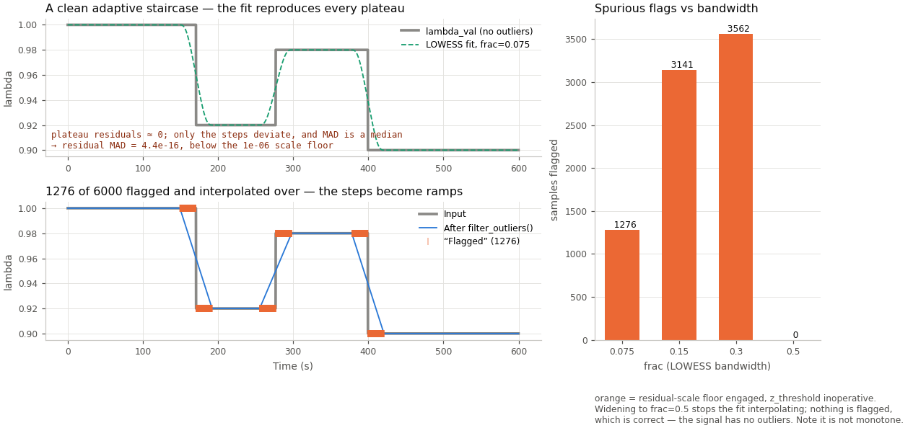
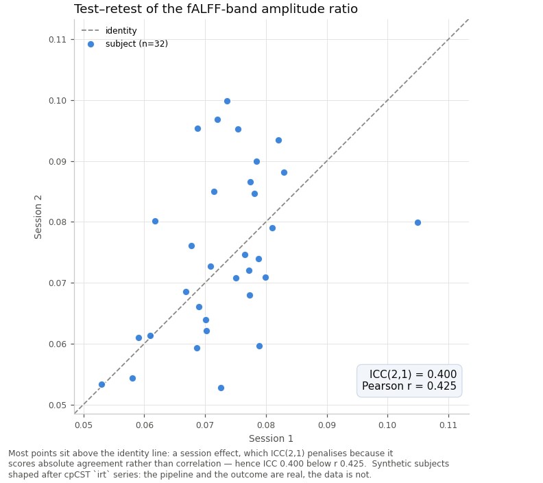
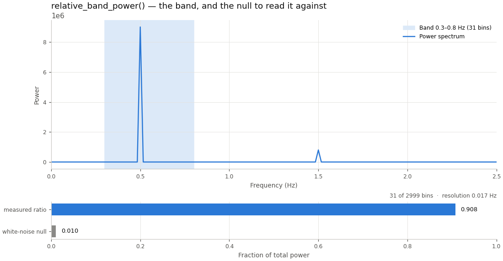

# baseTs Examples and Recipes

This document provides practical examples and code recipes for scientific applications using baseTs with the enhanced pandas Series foundation.

## Table of Contents
1. [Getting Started Examples](#getting-started-examples)
2. [Signal Processing Workflows](#signal-processing-workflows)
3. [Scientific Data Processing](#scientific-data-processing)
4. [Biophysical Signal Analysis](#biophysical-signal-analysis)
5. [Sensor Data and IoT Applications](#sensor-data-and-iot-applications)
6. [Enhanced Frequency Analysis](#enhanced-frequency-analysis)
7. [Performance Optimization](#performance-optimization)
8. [Integration Examples](#integration-examples)
9. [Multi-Channel Recipes with baseDf](#multi-channel-recipes-with-basedf)

---

## Getting Started Examples

### Basic Scientific Signal Processing

```python
import numpy as np
import pandas as pd
from baseTs import baseTs
import matplotlib.pyplot as plt

# Create a synthetic laboratory signal
def create_scientific_signal(n_points=1000, duration=10, sampling_rate=100):
    """Create a test signal mimicking experimental data."""
    t = np.linspace(0, duration, n_points)
    
    # Simulate typical experimental signal components
    signal = (
        5.0 * np.sin(2 * np.pi * 0.5 * t) +      # Slow oscillation (0.5 Hz)
        2.0 * np.sin(2 * np.pi * 3.0 * t) +      # Medium frequency (3 Hz)
        1.0 * np.sin(2 * np.pi * 10.0 * t) +     # Fast component (10 Hz)
        0.5 * np.random.randn(n_points)          # Measurement noise
    )
    
    # Add instrument artifacts (spikes)
    artifact_indices = np.random.choice(n_points, size=10, replace=False)
    signal[artifact_indices] += 8 * np.random.randn(len(artifact_indices))
    
    return signal, t

# Create and process the signal with enhanced pandas Series foundation
data, times = create_scientific_signal()
ts = baseTs(data=data, times=times, signal_name="Lab Signal", freq=100.0)

print(f"Created signal with {ts.len()} points")
print(f"Data range: {np.min(ts.data):.2f} to {np.max(ts.data):.2f}")
print(f"Sampling frequency: {ts.freq} Hz")

# Enhanced processing pipeline using pandas Series capabilities
# First remove spike artifacts using LOWESS outlier filtering
despiked = ts.set_outlier_filter(z_threshold=3).filter_outliers()
# filter_outliers leaves pre-existing acquisition gaps as NaN, and the FFT
# below rejects NaN rather than returning an all-NaN spectrum. Fill them.
despiked = despiked.interpolate_gaps()
filtered = despiked.lowpass_filter(cutoff=0.3)
smoothed = filtered.rolling_mean(window=20)  # Enhanced rolling operations
normalized = smoothed.zscale()

# Enhanced frequency analysis with windowing
freqs, power = normalized.get_frequency_content(window='hann')
peak_freq = normalized.get_peak_freq(window='hann', min_freq=0.1)

print(f"After processing: {normalized.len()} points")
print(f"Normalized mean: {np.mean(normalized.data):.6f}")
print(f"Normalized std: {np.std(normalized.data):.6f}")
print(f"Peak frequency: {peak_freq:.2f} Hz")
```

### Enhanced Pandas Series Capabilities

```python
def demonstrate_pandas_features(data, times):
    """Demonstrate enhanced pandas Series capabilities in baseTs."""
    
    # Create baseTs with datetime index for enhanced time-series operations
    dates = pd.date_range('2023-01-01', periods=len(data), freq='10ms')
    ts = baseTs(data=data, times=dates, signal_name="Enhanced Signal", freq=100.0)
    
    # Access native pandas methods directly
    print("Native pandas Series methods available:")
    print(f"  Data type: {type(ts)}")
    print(f"  Index type: {type(ts.index)}")
    print(f"  Series describe(): \n{ts.describe()}")
    
    # Enhanced rolling operations with pandas power
    rolling_stats = {
        'mean': ts.rolling_mean(window=50),
        'std': ts.rolling_std(window=50),
        'median': ts.rolling(50).median(),  # Direct pandas access
        'quantile_95': ts.rolling(50).quantile(0.95)
    }
    
    # The DatetimeIndex was converted to seconds since its first stamp at
    # the constructor; the stamps are the `datetimes` accessor, and a date
    # string bound on time_slice is placed against that origin
    time_slice = ts.time_slice(start_time='2023-01-01 00:01:00',
                               end_time='2023-01-01 00:03:00')

    # Statistical summary, on the seconds index like every other method
    stats = ts.get_statistics()

    print(f"\nEnhanced capabilities:")
    print(f"  Rolling mean length: {rolling_stats['mean'].len()}")
    print(f"  Time slice length: {time_slice.len()}")
    print(f"  First stamp: {ts.datetimes[0]}, duration {stats['duration']:.2f} s")
    print(f"  Native pandas correlation: {ts.autocorr(lag=1):.3f}")
    
    return ts, rolling_stats, time_slice

# Demonstrate enhanced features
enhanced_ts, stats, slice_data = demonstrate_pandas_features(data, times)
```

---

## Signal Processing Workflows

### EEG Signal Analysis with Enhanced FFT

```python
def process_eeg_signal(raw_eeg, sampling_rate=250):
    """
    Process EEG signal with enhanced frequency analysis capabilities.
    
    Args:
        raw_eeg: Raw EEG data (microvolts)
        sampling_rate: Sampling rate in Hz
    
    Returns:
        Processed EEG signal with frequency analysis
    """
    # Create time axis
    times = np.arange(len(raw_eeg)) / sampling_rate
    
    # Create baseTs object with enhanced capabilities
    eeg = baseTs(data=raw_eeg, times=times, signal_name="EEG", freq=sampling_rate)
    
    # Enhanced EEG processing pipeline
    # 1. Remove spike artifacts using LOWESS outlier filtering
    despiked = eeg.set_outlier_filter(z_threshold=3.5).filter_outliers()
    
    # 2. Remove DC offset and detrend
    detrended = despiked.detrend(method='linear')
    
    # 3. Bandpass filter (1-50 Hz for typical EEG analysis)
    nyquist = sampling_rate / 2
    high_cutoff = min(50.0 / nyquist, 0.95)  # Ensure valid cutoff
    bandpassed = detrended.lowpass_filter(cutoff=high_cutoff)
    
    # 4. Enhanced interpolation for any gaps
    interpolated = bandpassed.interpolate_gaps(method='spline', order=3)
    
    # 5. Z-score normalization
    normalized = interpolated.zscale()
    
    # Enhanced frequency analysis with windowing
    freqs, power = normalized.get_frequency_content(window='hann')
    
    # Calculate power in standard EEG frequency bands
    def calculate_band_power(frequencies, power_spectrum, freq_min, freq_max):
        """Calculate total power within a frequency band."""
        band_mask = (frequencies >= freq_min) & (frequencies <= freq_max)
        if np.any(band_mask):
            return np.sum(power_spectrum[band_mask])
        return 0.0
    
    # Define standard EEG frequency bands
    eeg_bands = {
        'delta': (0.5, 4),      # Delta waves (deep sleep)
        'theta': (4, 8),        # Theta waves (drowsiness, meditation)
        'alpha': (8, 13),       # Alpha waves (relaxed awareness)
        'beta': (13, 30),       # Beta waves (active concentration)
        'gamma': (30, 50)       # Gamma waves (cognitive processing)
    }
    
    # Calculate absolute power in each band
    band_powers = {}
    total_power = np.sum(power)
    
    for band_name, (low_freq, high_freq) in eeg_bands.items():
        absolute_power = calculate_band_power(freqs, power, low_freq, high_freq)
        relative_power = (absolute_power / total_power) * 100 if total_power > 0 else 0
        
        band_powers[band_name] = {
            'absolute_power': absolute_power,
            'relative_power': relative_power,
            'frequency_range': (low_freq, high_freq),
            'peak_frequency': normalized.get_peak_freq(window='hann', min_freq=low_freq, max_freq=high_freq)
        }
    
    # Calculate band ratios (clinically relevant)
    alpha_beta_ratio = (band_powers['alpha']['absolute_power'] / 
                       band_powers['beta']['absolute_power']) if band_powers['beta']['absolute_power'] > 0 else 0
    
    theta_beta_ratio = (band_powers['theta']['absolute_power'] / 
                       band_powers['beta']['absolute_power']) if band_powers['beta']['absolute_power'] > 0 else 0
    
    return {
        'processed': normalized,
        'frequency_content': (freqs, power),
        'band_powers': band_powers,
        'band_ratios': {
            'alpha_beta_ratio': alpha_beta_ratio,
            'theta_beta_ratio': theta_beta_ratio
        },
        'total_power': total_power
    }

# Generate realistic EEG signal
sampling_rate = 250  # Hz
duration = 60        # seconds
n_samples = sampling_rate * duration
t = np.arange(n_samples) / sampling_rate

# Simulate multi-component EEG signal
eeg_signal = (
    15 * np.sin(2 * np.pi * 10 * t + np.random.randn(n_samples) * 0.1) +  # Alpha rhythm with phase noise
    8 * np.sin(2 * np.pi * 20 * t + np.random.randn(n_samples) * 0.2) +   # Beta rhythm
    5 * np.sin(2 * np.pi * 40 * t + np.random.randn(n_samples) * 0.3) +   # Gamma activity
    3 * np.random.randn(n_samples)  # Background noise
)

# Add realistic artifacts
artifact_times = [15, 30, 45]  # seconds
for artifact_time in artifact_times:
    start_idx = int(artifact_time * sampling_rate)
    end_idx = start_idx + int(0.2 * sampling_rate)  # 200ms artifact
    eeg_signal[start_idx:end_idx] += 30 * (np.random.randn(end_idx - start_idx) > 1.5)

eeg_results = process_eeg_signal(eeg_signal, sampling_rate)

print(f"Processed EEG: {eeg_results['processed'].len()} samples")
print(f"Total power: {eeg_results['total_power']:.4f}")

print("\nEEG Band Powers:")
for band_name, band_data in eeg_results['band_powers'].items():
    print(f"  {band_name.capitalize()} ({band_data['frequency_range'][0]}-{band_data['frequency_range'][1]} Hz):")
    print(f"    Absolute power: {band_data['absolute_power']:.4f}")
    print(f"    Relative power: {band_data['relative_power']:.1f}%")
    print(f"    Peak frequency: {band_data['peak_frequency']:.2f} Hz")

print(f"\nClinically Relevant Ratios:")
print(f"  Alpha/Beta ratio: {eeg_results['band_ratios']['alpha_beta_ratio']:.3f}")
print(f"  Theta/Beta ratio: {eeg_results['band_ratios']['theta_beta_ratio']:.3f}")

# Interpret the results
print(f"\nInterpretation:")
alpha_rel = eeg_results['band_powers']['alpha']['relative_power']
beta_rel = eeg_results['band_powers']['beta']['relative_power']
theta_rel = eeg_results['band_powers']['theta']['relative_power']

if alpha_rel > 30:
    print(f"  High alpha power ({alpha_rel:.1f}%) suggests relaxed, eyes-closed state")
elif beta_rel > 35:
    print(f"  High beta power ({beta_rel:.1f}%) suggests active concentration/alertness")
elif theta_rel > 25:
    print(f"  High theta power ({theta_rel:.1f}%) suggests drowsiness or meditative state")

if eeg_results['band_ratios']['alpha_beta_ratio'] > 1.5:
    print(f"  High alpha/beta ratio suggests relaxed state")
elif eeg_results['band_ratios']['theta_beta_ratio'] > 1.0:
    print(f"  High theta/beta ratio may indicate fatigue or inattention")
```

### Acoustic Signal Analysis

```python
def analyze_acoustic_signal(audio_data, sample_rate=44100):
    """
    Analyze acoustic signals with enhanced frequency analysis.
    
    Args:
        audio_data: Audio samples (range [-1, 1])
        sample_rate: Audio sample rate in Hz
    
    Returns:
        Comprehensive acoustic analysis
    """
    # Create time axis
    times = np.arange(len(audio_data)) / sample_rate
    
    # Create baseTs object with enhanced capabilities
    audio = baseTs(data=audio_data, times=times, signal_name="Acoustic Signal", freq=sample_rate)
    
    # Acoustic analysis pipeline
    # 1. Remove DC offset and detrend
    detrended = audio.detrend(method='linear')
    
    # 2. Apply gentle low-pass filter to remove high-frequency noise
    filtered = detrended.lowpass_filter(cutoff=0.9)  # Conservative filter
    
    # 3. Enhanced frequency analysis with different windows
    freq_analyses = {}
    for window in ['hann', 'hamming', 'blackman']:
        freqs, power = filtered.get_frequency_content(window=window)
        freq_analyses[window] = {
            'frequencies': freqs,
            'power': power,
            'peak_freq': filtered.get_peak_freq(window=window, min_freq=20.0, max_freq=20000.0)
        }
    
    # 4. Spectral characteristics
    freqs, power = filtered.get_frequency_content(window='hann')
    
    # Calculate spectral centroid (brightness measure)
    spectral_centroid = np.sum(freqs * power) / np.sum(power)
    
    # Calculate spectral bandwidth
    spectral_variance = np.sum(((freqs - spectral_centroid) ** 2) * power) / np.sum(power)
    spectral_bandwidth = np.sqrt(spectral_variance)
    
    # 5. Dynamic analysis using rolling windows
    window_size = min(1024, len(audio_data) // 10)  # Adaptive window
    if window_size > 10:
        rms_energy = filtered.rolling(window_size).apply(lambda x: np.sqrt(np.mean(x**2)))
        zero_crossing_rate = filtered.rolling(window_size).apply(
            lambda x: np.sum(np.diff(np.sign(x)) != 0) / len(x)
        )
    else:
        rms_energy = None
        zero_crossing_rate = None
    
    return {
        'processed': filtered,
        'frequency_analyses': freq_analyses,
        'spectral_features': {
            'centroid': spectral_centroid,
            'bandwidth': spectral_bandwidth,
            'peak_frequency': freq_analyses['hann']['peak_freq']
        },
        'temporal_features': {
            'rms_energy': rms_energy,
            'zero_crossing_rate': zero_crossing_rate
        }
    }

# Generate realistic acoustic signal (bird song simulation)
sample_rate = 22050  # Reduced for efficiency
duration = 3  # seconds
t = np.arange(sample_rate * duration) / sample_rate

# Simulate bird song with frequency modulation
fundamental = 2000  # Hz
modulation_rate = 5  # Hz
modulation_depth = 500  # Hz

instantaneous_freq = fundamental + modulation_depth * np.sin(2 * np.pi * modulation_rate * t)
phase = np.cumsum(2 * np.pi * instantaneous_freq / sample_rate)

# Create bird song with harmonics
audio_signal = (
    0.5 * np.sin(phase) +                    # Fundamental
    0.3 * np.sin(2 * phase) +                # Second harmonic
    0.2 * np.sin(3 * phase) +                # Third harmonic
    0.1 * np.random.randn(len(t))            # Background noise
)

# Add amplitude envelope (attack-decay)
envelope = np.exp(-t / 0.5) * (1 - np.exp(-t / 0.05))
audio_signal *= envelope

# Normalize
audio_signal = audio_signal / np.max(np.abs(audio_signal)) * 0.8

acoustic_results = analyze_acoustic_signal(audio_signal, sample_rate)
print(f"Acoustic Analysis Results:")
print(f"Spectral centroid: {acoustic_results['spectral_features']['centroid']:.1f} Hz")
print(f"Spectral bandwidth: {acoustic_results['spectral_features']['bandwidth']:.1f} Hz")
print(f"Peak frequency (Hann): {acoustic_results['spectral_features']['peak_frequency']:.1f} Hz")
for window, analysis in acoustic_results['frequency_analyses'].items():
    print(f"Peak frequency ({window}): {analysis['peak_freq']:.1f} Hz")
```

---

## Scientific Data Processing

### Experimental Time-Series Analysis

```python
def analyze_experimental_timeseries(measurements, timestamps, metadata=None):
    """
    Comprehensive analysis of experimental time-series data.
    
    Args:
        measurements: Array of measured values
        timestamps: Array of measurement times, in seconds, or a
            DatetimeIndex (converted to seconds since its first stamp at
            the constructor; the stamps stay reachable as `ts.datetimes`)
        metadata: Dictionary of experimental metadata
    
    Returns:
        Dictionary containing analysis results
    """
    if metadata is None:
        metadata = {}
    
    # Create baseTs object with enhanced capabilities
    ts = baseTs(data=measurements, times=timestamps,
                signal_name=metadata.get('experiment_name', 'Experiment'),
                freq=metadata.get('sampling_rate', 1.0))
    
    # Quality assessment
    outlier_mask = ts.detect_outliers(method='modified_zscore', threshold=3.5)
    n_outliers = int(outlier_mask.sum())
    data_completeness = 1 - np.sum(np.isnan(measurements)) / len(measurements)
    
    # Signal processing with enhanced methods
    # 1. Remove spike artifacts first using LOWESS outlier filtering
    despiked = ts.set_outlier_filter(z_threshold=3.5).filter_outliers()

    # 1b. Fill acquisition gaps. filter_outliers deliberately leaves them as
    # NaN, and the frequency analysis in step 4 rejects NaN input.
    despiked = despiked.interpolate_gaps()

    # 2. Remove trend
    detrended = despiked.detrend(method='linear')
    
    # 3. Enhanced smoothing with rolling operations
    window_size = max(10, len(measurements) // 100)
    smoothed = detrended.rolling_mean(window=window_size, center=True)
    
    # 4. Enhanced frequency analysis with windowing
    freq_content = {}
    for window in ['hann', 'hamming', 'blackman']:
        freqs, power = detrended.get_frequency_content(window=window)
        dominant_freq = detrended.get_peak_freq(window=window, min_freq=0.001)
        freq_content[window] = {
            'frequencies': freqs,
            'power': power,
            'dominant_frequency': dominant_freq
        }
    
    # 5. Statistical analysis
    stats = detrended.get_statistics()
    
    # 6. Temporal analysis
    if len(detrended.data) > 50:
        # Change point detection using rolling statistics
        rolling_mean = detrended.rolling_mean(window=20)
        rolling_std = detrended.rolling_std(window=20)
        
        # Detect periods of high variability
        stability_metric = rolling_std.data / (np.abs(rolling_mean.data) + 1e-10)
        high_variability_periods = np.where(stability_metric > np.percentile(stability_metric, 90))[0]
    else:
        high_variability_periods = []
    
    # 7. Correlation analysis (if multiple measurements)
    autocorr_1 = np.corrcoef(detrended.data[:-1], detrended.data[1:])[0, 1] if len(detrended.data) > 1 else 0

    # rolling_mean trims the window's edges, so the smoothed series is shorter
    # than detrended; subtracting as series aligns them on the time index
    residual = (detrended - smoothed).dropna()
    
    return {
        'original': ts,
        'despiked': despiked,
        'processed': detrended,
        'smoothed': smoothed,
        'quality_metrics': {
            'data_completeness': data_completeness,
            'outlier_rate': n_outliers / len(measurements),
            'signal_to_noise_ratio': np.std(smoothed.data) / np.std(residual.data) if np.std(residual.data) > 0 else np.inf
        },
        'frequency_analysis': freq_content,
        'statistics': stats,
        'temporal_features': {
            'autocorrelation_lag1': autocorr_1,
            'high_variability_periods': high_variability_periods,
            'trend_strength': 1 - np.var(detrended.data - ts.detrend(method='linear').data) / np.var(detrended.data) if np.var(detrended.data) > 0 else 0
        },
        'metadata': metadata
    }

# Example: Environmental monitoring data
np.random.seed(42)
sampling_rate = 1/60  # One measurement per minute
duration_hours = 24  # 24 hours of data
n_points = int(duration_hours * 60)  # 1440 points

# Generate realistic environmental data (temperature)
time_hours = np.linspace(0, duration_hours, n_points)
timestamps = time_hours * 3600.0  # seconds since the start of the run

# Simulate daily temperature cycle with noise
daily_cycle = 20 + 8 * np.sin(2 * np.pi * time_hours / 24 - np.pi/2)  # Temperature cycle
seasonal_trend = 0.01 * time_hours  # Slight warming trend
instrument_noise = 0.5 * np.random.randn(n_points)
measurement_spikes = np.zeros(n_points)

# Add occasional measurement spikes (sensor errors)
spike_indices = np.random.choice(n_points, size=20, replace=False)
measurement_spikes[spike_indices] = 5 * np.random.randn(len(spike_indices))

temperature = daily_cycle + seasonal_trend + instrument_noise + measurement_spikes

metadata = {
    'experiment_name': 'Environmental Temperature Monitoring',
    'location': 'Weather Station Alpha',
    'sensor_type': 'RTD Pt100',
    'sampling_rate': sampling_rate,
    'units': 'Celsius'
}

analysis = analyze_experimental_timeseries(temperature, timestamps, metadata)

print("Experimental Analysis Results:")
print(f"Data completeness: {analysis['quality_metrics']['data_completeness']:.3f}")
print(f"Outlier rate: {analysis['quality_metrics']['outlier_rate']:.3f}")
print(f"SNR: {analysis['quality_metrics']['signal_to_noise_ratio']:.2f}")
print(f"Dominant frequency (Hann): {analysis['frequency_analysis']['hann']['dominant_frequency']:.6f} cycles/min")
print(f"Mean temperature: {analysis['statistics']['mean']:.2f}°C")
print(f"Temperature range: {analysis['statistics']['min']:.2f} to {analysis['statistics']['max']:.2f}°C")
print(f"Autocorrelation (lag-1): {analysis['temporal_features']['autocorrelation_lag1']:.3f}")
```

### Biorhythm and Circadian Analysis

```python
def circadian_analysis(data, timestamps, period_hours=24):
    """
    Analyze circadian patterns in biological time series data.
    
    Args:
        data: Time series data (e.g., activity, temperature, hormone levels)
        timestamps: DateTime timestamps
        period_hours: Expected circadian period in hours (default 24)
    
    Returns:
        Circadian analysis components
    """
    # Create baseTs with enhanced capabilities
    ts = baseTs(data=data, times=pd.to_datetime(timestamps), 
                signal_name="Circadian Signal", freq=1/3600)  # Hourly sampling assumed
    
    # Enhanced circadian analysis
    # 1. Detrend to remove long-term changes
    detrended = ts.detrend(method='linear')
    
    # 2. Calculate trend using long-term rolling mean
    trend_window = max(period_hours * 7, len(data) // 20)  # 7-day window minimum
    if trend_window < len(data):
        trend = ts.rolling_mean(window=int(trend_window), center=True)
    else:
        trend = ts.apply_function(lambda x: np.full_like(x, np.mean(x)))
    
    # 3. Extract circadian component using enhanced frequency analysis
    circadian_freq = 1 / period_hours  # cycles per hour
    
    # Use enhanced FFT with windowing to find circadian components
    freqs, power = detrended.get_frequency_content(window='hann')
    
    # Find frequencies around circadian range (18-30 hour periods)
    circadian_range = (1/30, 1/18)  # cycles per hour
    circadian_mask = (freqs >= circadian_range[0]) & (freqs <= circadian_range[1])
    
    if np.any(circadian_mask):
        circadian_freqs = freqs[circadian_mask]
        circadian_power = power[circadian_mask]
        dominant_circadian_freq = circadian_freqs[np.argmax(circadian_power)]
        dominant_period = 1 / dominant_circadian_freq if dominant_circadian_freq > 0 else period_hours
    else:
        dominant_period = period_hours
        dominant_circadian_freq = 1 / period_hours
    
    # 4. Phase analysis - find acrophase (peak time)
    hours_of_day = np.array([t.hour + t.minute/60 for t in pd.to_datetime(timestamps)])
    hourly_means = np.zeros(24)
    
    for hour in range(24):
        hour_mask = np.abs(hours_of_day - hour) < 0.5
        if np.any(hour_mask):
            hourly_means[hour] = np.mean(detrended.data[hour_mask])
    
    acrophase_hour = np.argmax(hourly_means)
    amplitude = (np.max(hourly_means) - np.min(hourly_means)) / 2
    
    # 5. Circadian rhythm strength (cosinor analysis approximation)
    time_hours = np.array([(t - pd.to_datetime(timestamps)[0]).total_seconds() / 3600 
                          for t in pd.to_datetime(timestamps)])
    
    # Fit cosine function
    phase_rad = 2 * np.pi * acrophase_hour / 24
    cosine_fit = amplitude * np.cos(2 * np.pi * time_hours / dominant_period - phase_rad)
    rhythm_strength = np.corrcoef(detrended.data, cosine_fit)[0, 1] ** 2  # R-squared
    
    # 6. Calculate residual (non-circadian component)
    residual_data = detrended.data - cosine_fit
    residual = baseTs(data=residual_data, times=timestamps, signal_name="Residual")
    
    return {
        'original': ts,
        'detrended': detrended,
        'trend': trend,
        'residual': residual,
        'circadian_metrics': {
            'dominant_period_hours': dominant_period,
            'acrophase_hour': acrophase_hour,
            'amplitude': amplitude,
            'rhythm_strength': rhythm_strength,
            'hourly_pattern': hourly_means
        },
        'frequency_analysis': {
            'frequencies': freqs,
            'power': power,
            'circadian_frequencies': freqs[circadian_mask] if np.any(circadian_mask) else [],
            'circadian_power': power[circadian_mask] if np.any(circadian_mask) else []
        }
    }

# Example: Analyze simulated body temperature rhythm
np.random.seed(42)
n_days = 14  # Two weeks of data
sampling_interval_hours = 0.25  # 15-minute intervals
n_points = int(n_days * 24 / sampling_interval_hours)

# Generate timestamps
start_time = pd.Timestamp('2023-07-01 00:00:00')
timestamps = pd.date_range(start_time, periods=n_points, freq='15min')

# Simulate circadian body temperature
time_hours = np.arange(n_points) * sampling_interval_hours

# Core body temperature components
baseline_temp = 37.0  # °C
circadian_amplitude = 0.5  # °C
circadian_period = 24.2  # Slightly longer than 24h (free-running)
acrophase = 18.0  # Peak at 6 PM

# Generate circadian pattern
circadian_component = circadian_amplitude * np.cos(2 * np.pi * (time_hours - acrophase) / circadian_period)

# Add ultradian rhythms (shorter cycles)
ultradian_90min = 0.1 * np.sin(2 * np.pi * time_hours / 1.5)  # 90-minute cycle
ultradian_4h = 0.15 * np.sin(2 * np.pi * time_hours / 4)     # 4-hour cycle

# Add noise and long-term trend
measurement_noise = 0.05 * np.random.randn(n_points)
long_term_trend = 0.001 * time_hours  # Slight increase over time

# Combine components
body_temperature = (baseline_temp + circadian_component + 
                   ultradian_90min + ultradian_4h + 
                   measurement_noise + long_term_trend)

# Perform circadian analysis
circadian_results = circadian_analysis(body_temperature, timestamps)

print("Circadian Analysis Results:")
print(f"Detected period: {circadian_results['circadian_metrics']['dominant_period_hours']:.2f} hours")
print(f"Acrophase: {circadian_results['circadian_metrics']['acrophase_hour']:.1f}:00")
print(f"Amplitude: ±{circadian_results['circadian_metrics']['amplitude']:.3f}°C")
print(f"Rhythm strength (R²): {circadian_results['circadian_metrics']['rhythm_strength']:.3f}")
print(f"Peak temperature hour: {np.argmax(circadian_results['circadian_metrics']['hourly_pattern']):.0f}:00")
print(f"Trough temperature hour: {np.argmin(circadian_results['circadian_metrics']['hourly_pattern']):.0f}:00")
```

---

## Biophysical Signal Analysis

### Adaptive-staircase data and the residual-scale floor (cpCST `lambda_val`)

The signal this library was written for is `lambda_val`, the adaptive-staircase
parameter of a critical-stability tracking task: long plateaus while performance
is stable, occasional steps at reversals. It is also the signal that breaks the
default outlier filter, and the failure is silent unless you look for it.



LOWESS reproduces a staircase's plateaus exactly and deviates only at the steps.
The residual scale is a **median** absolute deviation, so the near-zero plateau
residuals dominate it and it collapses — measured at 4.4e-16 above, far below
the `1e-06` floor. Every z-score is then divided by that floor instead, and
`z_threshold` stops meaning anything. On the clean staircase above, **1276 of
6000 samples are flagged and interpolated over**, turning every step into a
ramp, and none of them is an outlier.

This is not a hypothetical: CHANGELOG 0.3.0 records **141 of 262 real cpCST
series** hitting the floor at the default settings. Since 0.3.0 the filter warns
when the clamp engages — treat that warning as a result.

```python
import warnings
import numpy as np
from baseTs import baseTs

# A lambda_val-style staircase: long plateaus, occasional steps, no outliers.
rng = np.random.RandomState(7)
n = 6000
lam = np.empty(n)
value, i = 1.0, 0
while i < n:
    run = max(4, int(rng.normal(1200, 300)))
    lam[i:i + run] = value
    value += rng.choice([-0.08, 0.06])
    i += run
times = np.arange(n) / 10.0

ts = baseTs(lam, times, freq=10.0, signal_name="lambda_val")
ts.set_outlier_filter(z_threshold=3.0, frac=0.075)

# filter_outliers() warns when the residual scale collapses onto its floor.
# Treat that warning as a result, not noise: it means z_threshold did nothing.
with warnings.catch_warnings(record=True) as caught:
    warnings.simplefilter("always")
    despiked = ts.filter_outliers()
    floored = [w for w in caught if issubclass(w.category, RuntimeWarning)]

print(f"scale floor engaged: {bool(floored)}")
print(f"flagged on a signal with no outliers: {len(despiked.outlier_indices)}")

# Widening the LOWESS bandwidth stops the fit reproducing the plateaus exactly.
ts.set_outlier_filter(frac=0.5)
with warnings.catch_warnings(record=True) as caught:
    warnings.simplefilter("always")
    fixed = ts.filter_outliers()
print(f"flagged at frac=0.5: {len(fixed.outlier_indices)}")
```

Widening is not monotone — `frac=0.15` and `frac=0.3` flag *more* than the
default before `frac=0.5` stops the collapse. Sweep it on your own series rather
than assuming a larger window is safer. And consider whether a staircase should
be run through a LOWESS despiker at all: what looks like an artifact here is the
signal's defining feature.

### Test–retest reliability of a band-power outcome (cpCST `irt`)

A cleaned trace is an intermediate, not a result. What a session-to-session study
reports is whether the number surviving the pipeline is reproducible — and that
is the quantity a change to any filter default moves.



32 subjects, two sessions each, `irt`-style series carrying a subject-level
slow-band drive plus session noise and blink-like spikes. Each series runs the
same chain the library was built for — `filter_outliers()` →
`interpolate_gaps()` → `detrend()` → `relative_band_power(0.01, 0.1,
ratio='amplitude')` — and the two sessions are plotted against each other.

`ICC(2,1)` sits below Pearson `r` because most points fall above the identity
line: a session effect that a correlation ignores and an absolute-agreement ICC
penalises. Report the ICC, not the correlation, unless you have ruled that out.

Both figures are generated by `python examples/figures.py`, which is exercised by
`tests/unit/test_figures.py` — including the `ICC(2,1)` implementation, pinned
against the worked example in Shrout & Fleiss (1979). The subjects are synthetic;
the pipeline and the outcome are not.


### Multi-Channel Physiological Signal Analysis

```python
def analyze_physiological_signals(signal_data, channel_info, sampling_rate=1000):
    """
    Analyze multiple physiological signals simultaneously.
    
    Args:
        signal_data: Dictionary of {channel_name: signal_array}
        channel_info: Dictionary of {channel_name: {'type': 'ECG'|'EMG'|'EEG', 'units': str}}
        sampling_rate: Sampling rate in Hz
    
    Returns:
        Comprehensive physiological analysis
    """
    channels = list(signal_data.keys())
    n_samples = len(signal_data[channels[0]])
    times = np.arange(n_samples) / sampling_rate
    
    # Create baseTs objects for each channel
    signal_objects = {}
    for channel, data in signal_data.items():
        signal_objects[channel] = baseTs(
            data=data, times=times, 
            signal_name=f"{channel}_{channel_info[channel]['type']}",
            freq=sampling_rate
        )
    
    analysis_results = {}
    # Kept so the cross-channel section below analyses the cleaned signals
    # rather than the raw ones - the raw objects may still contain gaps.
    cleaned_objects = {}
    
    for channel, ts in signal_objects.items():
        channel_type = channel_info[channel]['type']
        
        # Common preprocessing - first remove spike artifacts
        # interpolate_gaps because filter_outliers leaves pre-existing gaps as
        # NaN, and get_frequency_content below rejects NaN input.
        despiked = ts.set_outlier_filter(z_threshold=3.5).filter_outliers()
        cleaned = despiked.interpolate_gaps().detrend(method='linear')
        cleaned_objects[channel] = cleaned
        
        if channel_type == 'ECG':
            # ECG-specific analysis
            # Enhanced frequency analysis for heart rate variability
            freqs, power = cleaned.get_frequency_content(window='hann')
            
            # Heart rate variability frequency bands
            vlf_band = (0.003, 0.04)  # Very low frequency
            lf_band = (0.04, 0.15)    # Low frequency
            hf_band = (0.15, 0.4)     # High frequency
            
            # Calculate power in each band
            vlf_power = np.sum(power[(freqs >= vlf_band[0]) & (freqs <= vlf_band[1])])
            lf_power = np.sum(power[(freqs >= lf_band[0]) & (freqs <= lf_band[1])])
            hf_power = np.sum(power[(freqs >= hf_band[0]) & (freqs <= hf_band[1])])
            
            # HRV metrics
            lf_hf_ratio = lf_power / hf_power if hf_power > 0 else np.inf
            
            analysis_results[channel] = {
                'processed': cleaned,
                'frequency_content': (freqs, power),
                'hrv_metrics': {
                    'vlf_power': vlf_power,
                    'lf_power': lf_power,
                    'hf_power': hf_power,
                    'lf_hf_ratio': lf_hf_ratio,
                    'total_power': vlf_power + lf_power + hf_power
                }
            }
            
        elif channel_type == 'EMG':
            # EMG-specific analysis
            # Enhanced frequency analysis for muscle activity
            freqs, power = cleaned.get_frequency_content(window='hann')
            
            # EMG frequency characteristics
            median_freq = freqs[np.argmin(np.abs(np.cumsum(power) - np.sum(power)/2))]
            mean_freq = np.sum(freqs * power) / np.sum(power)
            
            # EMG amplitude analysis
            rms_amplitude = np.sqrt(np.mean(cleaned.data**2))
            mean_absolute_value = np.mean(np.abs(cleaned.data))
            
            # Fatigue analysis using rolling statistics
            window_size = min(1000, len(cleaned.data) // 10)
            if window_size > 10:
                rolling_rms = cleaned.rolling(window_size).apply(lambda x: np.sqrt(np.mean(x**2)))
                rolling_median_freq = []  # Would need sliding FFT for proper implementation
                fatigue_trend = np.polyfit(range(len(rolling_rms.data)), rolling_rms.data, 1)[0]
            else:
                fatigue_trend = 0
            
            analysis_results[channel] = {
                'processed': cleaned,
                'frequency_content': (freqs, power),
                'emg_metrics': {
                    'rms_amplitude': rms_amplitude,
                    'mean_absolute_value': mean_absolute_value,
                    'median_frequency': median_freq,
                    'mean_frequency': mean_freq,
                    'fatigue_trend': fatigue_trend
                }
            }
            
        elif channel_type == 'EEG':
            # EEG-specific analysis
            # Enhanced frequency analysis for brain activity
            freqs, power = cleaned.get_frequency_content(window='hann')
            
            # EEG frequency bands
            delta_band = (0.5, 4)    # Delta waves
            theta_band = (4, 8)      # Theta waves
            alpha_band = (8, 13)     # Alpha waves
            beta_band = (13, 30)     # Beta waves
            gamma_band = (30, 100)   # Gamma waves
            
            # Calculate relative power in each band
            total_power = np.sum(power)
            band_powers = {}
            for band_name, (low, high) in [('delta', delta_band), ('theta', theta_band), 
                                          ('alpha', alpha_band), ('beta', beta_band), 
                                          ('gamma', gamma_band)]:
                band_mask = (freqs >= low) & (freqs <= high)
                band_power = np.sum(power[band_mask])
                band_powers[f'{band_name}_power'] = band_power
                band_powers[f'{band_name}_relative'] = band_power / total_power if total_power > 0 else 0
            
            # Dominant frequency in alpha band
            alpha_peak = cleaned.get_peak_freq(window='hann', min_freq=8, max_freq=13)
            
            analysis_results[channel] = {
                'processed': cleaned,
                'frequency_content': (freqs, power),
                'eeg_metrics': {
                    **band_powers,
                    'alpha_peak_frequency': alpha_peak,
                    'total_power': total_power
                }
            }
    
    # Cross-channel analysis
    cross_channel_analysis = {}
    channel_pairs = [(c1, c2) for i, c1 in enumerate(channels) for c2 in channels[i+1:]]
    
    for c1, c2 in channel_pairs:
        # Cross-correlation
        # Cleaned, not raw: get_frequency_content rejects NaN, and the raw
        # objects may still hold acquisition gaps.
        if len(cleaned_objects[c1].data) == len(cleaned_objects[c2].data):
            cross_corr = np.corrcoef(cleaned_objects[c1].data, cleaned_objects[c2].data)[0, 1]
            
            # Coherence analysis (simplified)
            freqs1, power1 = cleaned_objects[c1].get_frequency_content(window='hann')
            freqs2, power2 = cleaned_objects[c2].get_frequency_content(window='hann')
            
            # Frequency alignment for coherence (simplified)
            if len(freqs1) == len(freqs2):
                coherence = np.abs(np.correlate(power1, power2, mode='valid')[0]) / (np.sqrt(np.sum(power1**2) * np.sum(power2**2)))
            else:
                coherence = 0
            
            cross_channel_analysis[f'{c1}_{c2}'] = {
                'cross_correlation': cross_corr,
                'coherence': coherence
            }
    
    return {
        'individual_channels': analysis_results,
        'cross_channel': cross_channel_analysis,
        'metadata': {
            'sampling_rate': sampling_rate,
            'duration_seconds': n_samples / sampling_rate,
            'channels': channels,
            'channel_info': channel_info
        }
    }

# Example: Multi-channel physiological analysis
np.random.seed(42)
sampling_rate = 1000  # Hz
duration = 10  # seconds
n_samples = sampling_rate * duration
t = np.arange(n_samples) / sampling_rate

# Simulate physiological signals
# ECG signal
ecg_signal = (
    np.sin(2 * np.pi * 1.2 * t) +           # Heart rate ~72 bpm
    0.3 * np.sin(2 * np.pi * 2.4 * t) +     # Second harmonic
    0.1 * np.random.randn(n_samples)        # Noise
)

# EMG signal (muscle activity)
emg_signal = (
    0.5 * np.random.randn(n_samples) *      # Random muscle activity
    (1 + 0.5 * np.sin(2 * np.pi * 0.1 * t)) # Modulated by slow oscillation
)

# EEG signal (brain activity)
eeg_signal = (
    2 * np.sin(2 * np.pi * 10 * t + np.random.randn(n_samples) * 0.1) +  # Alpha rhythm
    1 * np.sin(2 * np.pi * 20 * t + np.random.randn(n_samples) * 0.2) +  # Beta activity
    0.5 * np.random.randn(n_samples)  # Background noise
)

# Define signal data and channel information
signal_data = {
    'Lead_I': ecg_signal,
    'Biceps': emg_signal,
    'Occipital': eeg_signal
}

channel_info = {
    'Lead_I': {'type': 'ECG', 'units': 'mV'},
    'Biceps': {'type': 'EMG', 'units': 'µV'},
    'Occipital': {'type': 'EEG', 'units': 'µV'}
}

# Perform analysis
physio_results = analyze_physiological_signals(signal_data, channel_info, sampling_rate)

print("Multi-Channel Physiological Analysis:")
for channel, results in physio_results['individual_channels'].items():
    channel_type = channel_info[channel]['type']
    print(f"\n{channel} ({channel_type}):")
    
    if channel_type == 'ECG':
        hrv = results['hrv_metrics']
        print(f"  LF/HF Ratio: {hrv['lf_hf_ratio']:.2f}")
        print(f"  Total HRV Power: {hrv['total_power']:.4f}")
    elif channel_type == 'EMG':
        emg = results['emg_metrics']
        print(f"  RMS Amplitude: {emg['rms_amplitude']:.4f} {channel_info[channel]['units']}")
        print(f"  Median Frequency: {emg['median_frequency']:.2f} Hz")
    elif channel_type == 'EEG':
        eeg = results['eeg_metrics']
        print(f"  Alpha Relative Power: {eeg['alpha_relative']:.3f}")
        print(f"  Alpha Peak: {eeg['alpha_peak_frequency']:.2f} Hz")
        print(f"  Beta Relative Power: {eeg['beta_relative']:.3f}")

print("\nCross-Channel Correlations:")
for pair, metrics in physio_results['cross_channel'].items():
    print(f"  {pair}: r = {metrics['cross_correlation']:.3f}, coherence = {metrics['coherence']:.3f}")
```

---

## Sensor Data and IoT Applications

### Multi-Sensor Data Fusion

```python
def fuse_sensor_data(sensor_readings, sensor_weights=None):
    """
    Fuse data from multiple sensors measuring the same quantity.
    
    Args:
        sensor_readings: Dictionary of {sensor_id: (data, times, uncertainty)}
        sensor_weights: Dictionary of sensor weights (default: uncertainty-based)
    
    Returns:
        Fused sensor data with uncertainty estimation
    """
    sensor_ids = list(sensor_readings.keys())
    
    # Align all sensor data to common time grid
    all_times = []
    for sensor_id, (data, times, uncertainty) in sensor_readings.items():
        all_times.extend(times)
    
    # Create common time grid (simplified - use first sensor's times)
    common_times = sensor_readings[sensor_ids[0]][1]
    
    # Interpolate all sensors to common time grid
    aligned_data = {}
    uncertainties = {}
    
    for sensor_id, (data, times, uncertainty) in sensor_readings.items():
        ts = baseTs(data=data, times=times, signal_name=sensor_id)
        
        # Simple alignment (in practice, you'd want proper interpolation)
        if len(times) == len(common_times):
            aligned_data[sensor_id] = data
            uncertainties[sensor_id] = uncertainty
        else:
            # Skip sensors with different time grids for this example
            continue
    
    # Calculate weights based on uncertainties (inverse variance weighting)
    if sensor_weights is None:
        weights = {}
        for sensor_id in aligned_data.keys():
            weights[sensor_id] = 1.0 / (uncertainties[sensor_id] ** 2)
        
        # Normalize weights
        total_weight = sum(weights.values())
        weights = {k: v / total_weight for k, v in weights.items()}
    else:
        weights = sensor_weights
    
    # Weighted fusion
    fused_data = np.zeros(len(common_times))
    fused_uncertainty = np.zeros(len(common_times))
    
    for i in range(len(common_times)):
        weighted_sum = 0
        weight_sum = 0
        variance_sum = 0
        
        for sensor_id in aligned_data.keys():
            weight = weights[sensor_id]
            value = aligned_data[sensor_id][i]
            uncertainty = uncertainties[sensor_id]
            
            if not np.isnan(value):
                weighted_sum += weight * value
                weight_sum += weight
                variance_sum += (weight ** 2) * (uncertainty ** 2)
        
        if weight_sum > 0:
            fused_data[i] = weighted_sum / weight_sum
            fused_uncertainty[i] = np.sqrt(variance_sum) / weight_sum
        else:
            fused_data[i] = np.nan
            fused_uncertainty[i] = np.inf
    
    # Create fused time series
    fused_ts = baseTs(data=fused_data, times=common_times, signal_name="Fused_Sensors")
    
    # Quality metrics
    agreement_metrics = {}
    for sensor_id in aligned_data.keys():
        differences = aligned_data[sensor_id] - fused_data
        rmse = np.sqrt(np.nanmean(differences ** 2))
        agreement_metrics[sensor_id] = {
            'rmse': rmse,
            'bias': np.nanmean(differences),
            'correlation': np.corrcoef(aligned_data[sensor_id], fused_data)[0, 1]
        }
    
    return {
        'fused_data': fused_ts,
        'uncertainty': fused_uncertainty,
        'weights': weights,
        'individual_sensors': {
            sensor_id: baseTs(data=data, times=common_times, signal_name=sensor_id)
            for sensor_id, data in aligned_data.items()
        },
        'agreement_metrics': agreement_metrics
    }

# Example: Fuse temperature readings from multiple sensors
np.random.seed(42)
n_points = 100
times = pd.date_range('2023-01-01', periods=n_points, freq='1min')

# True temperature
true_temp = 20 + 5 * np.sin(2 * np.pi * np.arange(n_points) / 50) + np.random.randn(n_points) * 0.1

# Simulate multiple sensors with different characteristics
sensor_readings = {}

# High-precision sensor
sensor_readings['TEMP_HIGH_PREC'] = (
    true_temp + 0.05 * np.random.randn(n_points),  # Low noise
    times,
    0.05  # Low uncertainty
)

# Medium-precision sensor
sensor_readings['TEMP_MEDIUM_PREC'] = (
    true_temp + 0.2 * np.random.randn(n_points),  # Medium noise
    times,
    0.2   # Medium uncertainty
)

# Low-precision sensor with bias
sensor_readings['TEMP_LOW_PREC'] = (
    true_temp + 0.5 + 0.5 * np.random.randn(n_points),  # High noise + bias
    times,
    0.5   # High uncertainty
)

fusion_result = fuse_sensor_data(sensor_readings)

print("Sensor Fusion Results:")
print("Sensor weights:")
for sensor_id, weight in fusion_result['weights'].items():
    print(f"  {sensor_id}: {weight:.3f}")

print("\nAgreement metrics:")
for sensor_id, metrics in fusion_result['agreement_metrics'].items():
    print(f"  {sensor_id}:")
    print(f"    RMSE: {metrics['rmse']:.3f}")
    print(f"    Bias: {metrics['bias']:.3f}")
    print(f"    Correlation: {metrics['correlation']:.3f}")
```

---

## Enhanced Frequency Analysis



A band ratio is hard to read on its own, so `details=True` returns a
`BandPowerResult` carrying `bin_fraction` — what an equal-power (white-noise)
series of the same length would score. Regenerate with
`python examples/figures.py`.

### Advanced Spectral Analysis with Windowing

```python
def comprehensive_spectral_analysis(ts, sampling_rate=None):
    """
    Perform comprehensive spectral analysis using enhanced FFT capabilities.
    
    Args:
        ts: baseTs object
        sampling_rate: Override sampling rate if different from ts.freq
    
    Returns:
        Dictionary containing various spectral analyses
    """
    if sampling_rate is not None:
        # This declares sampling_rate as the rate for ts; the declaration
        # holds only until an operation changes ts's time index, at which
        # point .freq re-derives from the index again.
        ts.freq = sampling_rate
    
    # Window functions to compare
    windows = ['hann', 'hamming', 'blackman', None]  # None = rectangular
    
    spectral_results = {}
    
    for window in windows:
        window_name = window if window is not None else 'rectangular'
        
        # Enhanced frequency analysis
        freqs, power = ts.get_frequency_content(window=window)
        
        # Find multiple peaks
        peak_freqs = []
        for n_peaks in [1, 3, 5]:
            peaks = ts.get_peak_freq(num_pks=n_peaks, window=window, min_freq=0.1)
            if isinstance(peaks, list):
                peak_freqs.append(peaks)
            else:
                peak_freqs.append([peaks])
        
        # Spectral characteristics
        # Spectral centroid (center of mass)
        spectral_centroid = np.sum(freqs * power) / np.sum(power) if np.sum(power) > 0 else 0
        
        # Spectral spread (bandwidth)
        spectral_variance = np.sum(((freqs - spectral_centroid) ** 2) * power) / np.sum(power) if np.sum(power) > 0 else 0
        spectral_spread = np.sqrt(spectral_variance)
        
        # Spectral rolloff (frequency below which 85% of energy is contained)
        cumulative_power = np.cumsum(power)
        total_power = cumulative_power[-1]
        rolloff_threshold = 0.85 * total_power
        rolloff_idx = np.where(cumulative_power >= rolloff_threshold)[0]
        spectral_rolloff = freqs[rolloff_idx[0]] if len(rolloff_idx) > 0 else freqs[-1]
        
        # Spectral flatness (measure of how flat/tonal the spectrum is)
        # Geometric mean / Arithmetic mean
        geometric_mean = np.exp(np.mean(np.log(power + 1e-10)))
        arithmetic_mean = np.mean(power)
        spectral_flatness = geometric_mean / arithmetic_mean if arithmetic_mean > 0 else 0
        
        spectral_results[window_name] = {
            'frequencies': freqs,
            'power': power,
            'peak_frequencies': {
                'top_1': peak_freqs[0],
                'top_3': peak_freqs[1],
                'top_5': peak_freqs[2]
            },
            'spectral_features': {
                'centroid': spectral_centroid,
                'spread': spectral_spread,
                'rolloff': spectral_rolloff,
                'flatness': spectral_flatness
            }
        }
    
    # Compare window effects
    window_comparison = {}
    for i, window1 in enumerate(windows):
        for window2 in windows[i+1:]:
            name1 = window1 if window1 is not None else 'rectangular'
            name2 = window2 if window2 is not None else 'rectangular'
            
            power1 = spectral_results[name1]['power']
            power2 = spectral_results[name2]['power']
            
            # Correlation between power spectra
            correlation = np.corrcoef(power1, power2)[0, 1] if len(power1) == len(power2) else 0
            
            # RMS difference
            rms_diff = np.sqrt(np.mean((power1 - power2)**2)) if len(power1) == len(power2) else np.inf
            
            window_comparison[f'{name1}_vs_{name2}'] = {
                'correlation': correlation,
                'rms_difference': rms_diff
            }
    
    return {
        'spectral_analyses': spectral_results,
        'window_comparison': window_comparison,
        'recommendations': {
            'best_window_for_peaks': 'blackman',  # Generally best for peak detection
            'best_window_for_general': 'hann',    # Good general purpose
            'best_window_for_resolution': 'rectangular'  # Best frequency resolution
        }
    }

# Example: Analyze a complex signal with multiple frequency components
np.random.seed(42)
sampling_rate = 1000  # Hz
duration = 5  # seconds
n_samples = sampling_rate * duration
t = np.arange(n_samples) / sampling_rate

# Create complex signal with multiple components
signal = (
    2.0 * np.sin(2 * np.pi * 10 * t) +       # 10 Hz component
    1.5 * np.sin(2 * np.pi * 25 * t) +       # 25 Hz component  
    1.0 * np.sin(2 * np.pi * 50 * t) +       # 50 Hz component
    0.8 * np.sin(2 * np.pi * 75 * t) +       # 75 Hz component
    0.5 * np.sin(2 * np.pi * 100 * t) +      # 100 Hz component
    0.3 * np.random.randn(n_samples)         # Noise
)

# Add some amplitude modulation
modulation = 1 + 0.3 * np.sin(2 * np.pi * 2 * t)
signal *= modulation

# Create baseTs object
ts = baseTs(data=signal, times=t, signal_name="Complex Signal", freq=sampling_rate)

# Perform comprehensive spectral analysis
spectral_analysis = comprehensive_spectral_analysis(ts)

print("Comprehensive Spectral Analysis Results:")
print("=" * 50)

for window_name, results in spectral_analysis['spectral_analyses'].items():
    print(f"\n{window_name.upper()} Window:")
    print(f"  Top 3 peaks: {[f'{f:.1f} Hz' for f in results['peak_frequencies']['top_3']]}")
    print(f"  Spectral centroid: {results['spectral_features']['centroid']:.1f} Hz")
    print(f"  Spectral spread: {results['spectral_features']['spread']:.1f} Hz")
    print(f"  Spectral rolloff: {results['spectral_features']['rolloff']:.1f} Hz")
    print(f"  Spectral flatness: {results['spectral_features']['flatness']:.3f}")

print(f"\nWindow Comparisons:")
for comparison, metrics in spectral_analysis['window_comparison'].items():
    print(f"  {comparison}: correlation = {metrics['correlation']:.3f}, RMS diff = {metrics['rms_difference']:.4f}")

print(f"\nRecommendations:")
for purpose, window in spectral_analysis['recommendations'].items():
    print(f"  {purpose}: {window}")
```

### Time-Frequency Analysis

```python
def time_frequency_analysis(ts, window_size=256, hop_size=128):
    """
    Perform time-frequency analysis using short-time FFT.
    
    Args:
        ts: baseTs object
        window_size: Size of each analysis window
        hop_size: Step size between windows
    
    Returns:
        Time-frequency representation
    """
    # Extract parameters
    data = ts.data
    sampling_rate = ts.freq
    
    # Calculate number of windows
    n_windows = (len(data) - window_size) // hop_size + 1
    
    # Initialize arrays
    time_centers = []
    frequency_content = []
    
    # Perform sliding window FFT
    for i in range(n_windows):
        start_idx = i * hop_size
        end_idx = start_idx + window_size
        
        # Extract window
        window_data = data[start_idx:end_idx]
        window_times = ts.times[start_idx:end_idx]
        
        # Create temporary baseTs object for this window
        temp_ts = baseTs(data=window_data, times=window_times, 
                        signal_name=f"Window_{i}", freq=sampling_rate)
        
        # Enhanced frequency analysis with Hann window
        freqs, power = temp_ts.get_frequency_content(window='hann')
        
        # Store results
        time_centers.append(np.mean(window_times))
        frequency_content.append(power)
    
    # Convert to arrays
    time_centers = np.array(time_centers)
    frequency_content = np.array(frequency_content).T  # Transpose for plotting
    
    # Calculate spectral features over time
    temporal_features = {
        'dominant_frequency': [],
        'spectral_centroid': [],
        'spectral_bandwidth': [],
        'spectral_rolloff': []
    }
    
    for i, power in enumerate(frequency_content.T):
        # Dominant frequency
        dominant_freq = freqs[np.argmax(power)]
        temporal_features['dominant_frequency'].append(dominant_freq)
        
        # Spectral centroid
        centroid = np.sum(freqs * power) / np.sum(power) if np.sum(power) > 0 else 0
        temporal_features['spectral_centroid'].append(centroid)
        
        # Spectral bandwidth
        variance = np.sum(((freqs - centroid) ** 2) * power) / np.sum(power) if np.sum(power) > 0 else 0
        bandwidth = np.sqrt(variance)
        temporal_features['spectral_bandwidth'].append(bandwidth)
        
        # Spectral rolloff
        cumulative_power = np.cumsum(power)
        total_power = cumulative_power[-1]
        rolloff_threshold = 0.85 * total_power
        rolloff_idx = np.where(cumulative_power >= rolloff_threshold)[0]
        rolloff = freqs[rolloff_idx[0]] if len(rolloff_idx) > 0 else freqs[-1]
        temporal_features['spectral_rolloff'].append(rolloff)
    
    # Convert to arrays
    for key in temporal_features:
        temporal_features[key] = np.array(temporal_features[key])
    
    return {
        'time_centers': time_centers,
        'frequencies': freqs,
        'spectrogram': frequency_content,
        'temporal_features': temporal_features,
        'parameters': {
            'window_size': window_size,
            'hop_size': hop_size,
            'n_windows': n_windows,
            'frequency_resolution': sampling_rate / window_size,
            'time_resolution': hop_size / sampling_rate
        }
    }

# Example: Analyze a signal with time-varying frequency content
np.random.seed(42)
sampling_rate = 1000  # Hz
duration = 10  # seconds
n_samples = sampling_rate * duration
t = np.arange(n_samples) / sampling_rate

# Create signal with time-varying frequency (frequency sweep)
f_start = 10  # Hz
f_end = 100   # Hz
instantaneous_freq = f_start + (f_end - f_start) * t / duration

# Generate frequency-swept signal
phase = np.cumsum(2 * np.pi * instantaneous_freq / sampling_rate)
signal = np.sin(phase)

# Add some noise and a constant frequency component
signal += 0.5 * np.sin(2 * np.pi * 50 * t)  # 50 Hz component
signal += 0.2 * np.random.randn(n_samples)   # Noise

# Create baseTs object
ts = baseTs(data=signal, times=t, signal_name="Frequency Sweep", freq=sampling_rate)

# Perform time-frequency analysis
tf_analysis = time_frequency_analysis(ts, window_size=512, hop_size=128)

print("Time-Frequency Analysis Results:")
print("=" * 40)
print(f"Parameters:")
print(f"  Window size: {tf_analysis['parameters']['window_size']} samples")
print(f"  Hop size: {tf_analysis['parameters']['hop_size']} samples")
print(f"  Number of windows: {tf_analysis['parameters']['n_windows']}")
print(f"  Frequency resolution: {tf_analysis['parameters']['frequency_resolution']:.2f} Hz")
print(f"  Time resolution: {tf_analysis['parameters']['time_resolution']:.3f} s")

print(f"\nTemporal Features:")
print(f"  Dominant frequency range: {np.min(tf_analysis['temporal_features']['dominant_frequency']):.1f} - {np.max(tf_analysis['temporal_features']['dominant_frequency']):.1f} Hz")
print(f"  Mean spectral centroid: {np.mean(tf_analysis['temporal_features']['spectral_centroid']):.1f} Hz")
print(f"  Mean spectral bandwidth: {np.mean(tf_analysis['temporal_features']['spectral_bandwidth']):.1f} Hz")

# Find times when dominant frequency changes most rapidly
freq_gradient = np.gradient(tf_analysis['temporal_features']['dominant_frequency'])
max_change_idx = np.argmax(np.abs(freq_gradient))
max_change_time = tf_analysis['time_centers'][max_change_idx]
print(f"  Maximum frequency change at: {max_change_time:.2f} s ({freq_gradient[max_change_idx]:.1f} Hz/window)")
```

### Relative Band Power and fALFF

Answering "how much of this signal lives in band X?" — the classic case being fractional amplitude
of low-frequency fluctuations (fALFF), which compares the 0.01–0.1 Hz band against the whole
spectrum.

```python
import numpy as np
from baseTs import baseTs

# Simulate a slow physiological signal: 0.05 Hz oscillation, a slow drift,
# a baseline offset, and measurement noise.
fs, duration = 2.0, 600.0            # 2 Hz for 10 minutes
n = int(fs * duration)
t = np.arange(n) / fs

np.random.seed(42)
signal = (
    np.sin(2 * np.pi * 0.05 * t)     # the low-frequency fluctuation of interest
    + 0.5 * np.random.randn(n)       # measurement noise
    + 0.002 * t                      # slow linear drift
    + 5.0                            # baseline offset
)

ts = baseTs(signal, t, freq=fs, signal_name="slow_oscillation")

# Detrend FIRST. Band power is a measurement, not a transform - the library
# leaves the preprocessing pipeline to you.
clean = ts.detrend('linear')

# Fraction of the signal's variance in the 0.01-0.1 Hz band (the default)
power_ratio = clean.relative_band_power()
print(f"Power ratio  : {power_ratio:.3f}")     # ~0.717

# Classic fALFF (amplitude convention, Zou et al. 2008)
falff = clean.falff()
print(f"fALFF        : {falff:.3f}")           # ~0.147
```

**Always interpret the ratio against its null.** For white noise both conventions converge on the
fraction of bins that fall inside the band — so a "high" number only means something relative to
that baseline:

```python
res = clean.relative_band_power(details=True)

print(f"ratio        : {res.ratio:.3f}")
print(f"null         : {res.bin_fraction:.3f}   (white-noise expectation)")
print(f"enrichment   : {res.ratio / res.bin_fraction:.1f}x")
print(f"band bins    : {res.n_band_bins} of {res.n_total_bins}")
print(f"resolution   : {res.freq_resolution:.5f} Hz")

# ratio        : 0.717
# null         : 0.092   (white-noise expectation)
# enrichment   : 7.8x
# band bins    : 55 of 599
# resolution   : 0.00167 Hz
```

**Check that your recording is long enough.** Frequency resolution is `1 / duration`, so a 0.01 Hz
lower edge needs at least 100 s of data just to land one bin in the band — and realistically several
hundred seconds for a stable estimate. A band narrower than the resolution raises a `ValueError`
that tells you how much data you would need:

```python
short = baseTs(signal[:100], t[:100], freq=fs)   # only 50 s
res_short = short.relative_band_power(details=True)
print(f"{res_short.n_band_bins} bins at {res_short.freq_resolution:.3f} Hz resolution")
# 5 bins at 0.020 Hz resolution   <- it computes, but it is far too coarse to trust

# Ask for a band narrower than the resolution and it refuses outright
try:
    short.relative_band_power(0.01, 0.015)
except ValueError as e:
    print(e)
# No frequency bins fall in [0.01, 0.015] Hz. The frequency resolution is
# 0.02 Hz (100 samples at 2.0 Hz); resolving a band this narrow needs at
# least 200 s of data.
```

Note that the coarse case does *not* raise — five bins is enough to produce a number. The guard
only catches a band with no bins at all, so checking `n_band_bins` and `freq_resolution` yourself
is worthwhile on short recordings.

**Choosing a convention.** `ratio='power'` gives the fraction of variance and stays roughly stable
across sampling rates; `ratio='amplitude'` reproduces published fALFF but its denominator grows with
the number of noise bins, so values are not comparable across acquisitions with different bandwidth:

```python
for fs_test in (0.5, 2.0, 10.0):
    n_test = int(fs_test * duration)
    tt = np.arange(n_test) / fs_test
    np.random.seed(3)
    sig = np.sin(2 * np.pi * 0.05 * tt) + 0.5 * np.random.randn(n_test)
    test_ts = baseTs(sig, tt, freq=fs_test)
    print(f"fs={fs_test:5}  power={test_ts.relative_band_power():.3f}  "
          f"amplitude={test_ts.falff():.3f}")

# fs=  0.5  power=0.807  amplitude=0.444
# fs=  2.0  power=0.686  amplitude=0.138
# fs= 10.0  power=0.676  amplitude=0.046
```

Same signal, same noise level — the amplitude ratio falls tenfold while the power ratio holds. If
you are comparing across recordings, use `ratio='power'`.

**Visualize the band** you measured:

```python
import matplotlib.pyplot as plt

fig, ax = plt.subplots(figsize=(10, 4))
clean.plot_fft_power(max_rate=0.3, highlight_band=(0.01, 0.1), ax=ax,
                     title="Power spectrum with fALFF band")
plt.show()
```

---

---

## Performance Optimization

### Large Dataset Processing

```python
def process_large_dataset(data_source, chunk_size=100000, operations=None):
    """
    Process large datasets in chunks to manage memory usage.
    
    Args:
        data_source: Function that yields (data, times) chunks
        chunk_size: Size of each processing chunk
        operations: List of operations to apply to each chunk
    
    Returns:
        Processed results
    """
    if operations is None:
        operations = [
            lambda ts: ts.lowpass_filter(cutoff=0.3),
            lambda ts: ts.zscale()
        ]
    
    processed_chunks = []
    chunk_stats = []
    
    for chunk_idx, (data_chunk, times_chunk) in enumerate(data_source(chunk_size)):
        print(f"Processing chunk {chunk_idx + 1}: {len(data_chunk)} points")
        
        # Process chunk with enhanced capabilities
        ts_chunk = baseTs(data=data_chunk, times=times_chunk, signal_name=f"Chunk_{chunk_idx}")
        
        # Apply operations
        processed_chunk = ts_chunk
        for operation in operations:
            processed_chunk = operation(processed_chunk)
        
        processed_chunks.append(processed_chunk)
        
        # Collect enhanced statistics
        stats = processed_chunk.get_statistics()
        chunk_stats.append(stats)
    
    # Combine chunks
    combined_data = np.concatenate([chunk.data for chunk in processed_chunks])
    combined_times = np.concatenate([chunk.times for chunk in processed_chunks])
    
    combined_ts = baseTs(data=combined_data, times=combined_times,
                        signal_name="Large_Dataset_Processed")
    
    # Overall statistics
    overall_stats = {
        'total_points': len(combined_data),
        'n_chunks': len(processed_chunks),
        'chunk_stats': chunk_stats,
        'overall_stats': combined_ts.get_statistics()
    }
    
    return combined_ts, overall_stats

# Example data generator for scientific measurements
def scientific_data_generator(chunk_size):
    """Generate a large scientific dataset in chunks."""
    total_size = 100000  # 100 thousand points here; millions work the same way
    n_chunks = total_size // chunk_size
    sampling_rate = 1000.0  # 1 kHz
    
    for i in range(n_chunks):
        start_time = i * chunk_size / sampling_rate
        times = start_time + np.arange(chunk_size) / sampling_rate
        
        # Generate synthetic scientific data with evolving characteristics
        base_freq = 1 + i * 0.1  # Slowly changing fundamental frequency
        measurement_drift = 0.001 * i * chunk_size  # Instrument drift
        
        # Multi-component signal
        data = (
            5.0 * np.sin(2 * np.pi * base_freq * times) +           # Main signal
            2.0 * np.sin(2 * np.pi * base_freq * 3 * times) +       # Third harmonic
            1.0 * np.sin(2 * np.pi * 0.1 * times) +                # Slow oscillation
            0.5 * np.random.randn(chunk_size) +                    # Measurement noise
            measurement_drift                                       # Instrument drift
        )
        
        # Add occasional artifacts
        if np.random.random() < 0.3:  # 30% chance per chunk
            artifact_start = np.random.randint(0, chunk_size - 100)
            artifact_end = artifact_start + 100
            data[artifact_start:artifact_end] += 10 * np.random.randn(100)
        
        yield data, times

# Enhanced operations for scientific data
scientific_operations = [
    lambda ts: ts.set_outlier_filter(z_threshold=3.5).filter_outliers(),  # Remove spike artifacts first
    lambda ts: ts.detrend(method='linear'),                    # Remove linear drift
    lambda ts: ts.lowpass_filter(cutoff=0.4),                # Anti-aliasing filter
    lambda ts: ts.rolling_mean(window=50),                    # Smoothing
    lambda ts: ts.zscale()                                    # Normalization
]

# Process large dataset
print("Processing large scientific dataset...")
result_ts, stats = process_large_dataset(scientific_data_generator,
                                        chunk_size=25000,
                                        operations=scientific_operations)

print(f"\nProcessing completed:")
print(f"Total points processed: {stats['total_points']:,}")
print(f"Number of chunks: {stats['n_chunks']}")
print(f"Final statistics:")
for key, value in stats['overall_stats'].items():
    if isinstance(value, (int, float)):
        print(f"  {key}: {value:.6f}")

# Analyze processing consistency across chunks
chunk_means = [chunk['mean'] for chunk in stats['chunk_stats']]
chunk_stds = [chunk['std'] for chunk in stats['chunk_stats']]

print(f"\nChunk-to-chunk consistency:")
# The default operations end in zscale(), so every chunk mean is 0 to within
# floating-point noise (~1e-15). A coefficient of variation divides by that
# mean: the result is meaningless, and when the noise cancels exactly it is a
# divide-by-zero. Report the spread of the means directly instead.
print(f"  Mean spread (std of chunk means): {np.std(chunk_means):.2e}")
# The standard deviations are centred on 1 after zscale(), so a CV is well
# defined here.
print(f"  Std variation (CV): {np.std(chunk_stds) / np.mean(chunk_stds) * 100:.2f}%")
```

---

## Integration Examples

### Pandas Integration

```python
def scientific_pandas_integration(ts_data):
    """
    Demonstrate advanced pandas integration for scientific time series.
    
    Args:
        ts_data: baseTs object
    
    Returns:
        Advanced analysis results using pandas functionality
    """
    # A baseTs keeps a seconds index whatever it was built from; the
    # calendar it was built from is the `datetimes` accessor. A series built
    # from seconds has no origin yet, so declare one first.
    if not ts_data.has_timestamp_offset:
        ts_data = ts_data.copy()
        ts_data.set_timestamp_offset(pd.Timestamp('2023-01-01').timestamp())
    stamps = ts_data.datetimes

    # pandas' calendar conveniences - offset-string windows such as
    # rolling('1h'), calendar-anchored resampling such as 'W' - need a
    # DatetimeIndex, so they run on a plain Series over the stamps
    calendar = pd.Series(ts_data.values, index=stamps)

    # Advanced pandas time series operations
    results = {}

    # 1. Resampling for different time scales. baseTs.resample() bins the
    # seconds from the origin, so fixed-length intervals stay a baseTs;
    # a weekly bin is calendar-anchored and goes through pandas
    results['hourly_mean'] = ts_data.resample('h')
    results['daily_max'] = ts_data.resample('D', method='max')
    results['daily_std'] = ts_data.resample('D', method='std')
    results['weekly_std'] = calendar.resample('W').std()

    # 2. Time-based grouping and analysis, keyed on the stamps
    results['monthly_stats'] = ts_data.groupby(stamps.month).agg([
        'mean', 'std', 'min', 'max', 'count'
    ])

    results['hourly_pattern'] = ts_data.groupby(stamps.hour).mean()
    results['day_of_week_pattern'] = ts_data.groupby(stamps.dayofweek).mean()

    # 3. Advanced rolling operations with offset-string windows
    results['rolling_stats'] = {
        'mean_1h': calendar.rolling('1h').mean(),
        'std_6h': calendar.rolling('6h').std(),
        'quantile_95_1d': calendar.rolling('1D').quantile(0.95),
        'autocorr_1h': calendar.rolling('1h', min_periods=3).apply(lambda x: x.autocorr(lag=1))
    }

    # 4. Trend analysis
    # Detrend and calculate trend strength
    detrended = calendar - calendar.rolling('1D').mean()
    trend_strength = 1 - detrended.var() / calendar.var()

    # 5. Seasonal decomposition (simplified)
    # Extract different time scales
    daily_cycle = ts_data.groupby([stamps.hour, stamps.minute]).mean()
    weekly_cycle = ts_data.groupby(stamps.dayofweek).mean()
    monthly_cycle = ts_data.groupby(stamps.day).mean()

    # 6. Change point detection using rolling statistics
    rolling_mean = calendar.rolling('2h').mean()
    rolling_std = calendar.rolling('2h').std()
    
    # Z-score of differences
    mean_changes = rolling_mean.diff().abs()
    std_changes = rolling_std.diff().abs()
    
    # Significant changes (beyond 2 sigma)
    mean_threshold = mean_changes.mean() + 2 * mean_changes.std()
    std_threshold = std_changes.mean() + 2 * std_changes.std()
    
    change_points = {
        'mean_changes': mean_changes[mean_changes > mean_threshold],
        'std_changes': std_changes[std_changes > std_threshold]
    }
    
    # 7. Cross-validation of patterns
    # Split data into training and testing
    # Split data into training and testing, by position: the index is
    # float seconds, so a bare `ts_data[:n]` would be a label slice
    split_point = len(ts_data) // 2
    train_data = ts_data.iloc[:split_point]
    test_data = ts_data.iloc[split_point:]
    
    # Compare patterns between halves; a slice keeps the origin, so each
    # half's stamps are its own
    train_hourly = train_data.groupby(train_data.datetimes.hour).mean()
    test_hourly = test_data.groupby(test_data.datetimes.hour).mean()
    
    # Correlation between training and testing patterns
    pattern_stability = train_hourly.corr(test_hourly)
    
    return {
        'resampled': results,
        'temporal_patterns': {
            'daily_cycle': daily_cycle,
            'weekly_cycle': weekly_cycle,
            'monthly_cycle': monthly_cycle,
            'pattern_stability': pattern_stability
        },
        'trend_analysis': {
            'trend_strength': trend_strength,
            'change_points': change_points
        },
        'summary_statistics': {
            'total_duration': pd.Timedelta(seconds=ts_data.duration()),
            'sampling_frequency': ts_data.freq,
            'data_completeness': 1 - ts_data.isna().sum() / len(ts_data)
        }
    }

# Example: Long-term environmental monitoring analysis
np.random.seed(42)
start_date = pd.Timestamp('2023-01-01')
end_date = pd.Timestamp('2023-12-31')
freq = '10min'  # 10-minute intervals

dates = pd.date_range(start_date, end_date, freq=freq)
n_points = len(dates)

# Generate realistic long-term environmental data
time_hours = np.arange(n_points) * 10 / 60  # Hours since start

# Multi-scale environmental patterns
annual_cycle = 5 * np.sin(2 * np.pi * time_hours / (365.25 * 24))  # Annual temperature variation
daily_cycle = 8 * np.sin(2 * np.pi * time_hours / 24 - np.pi/3)    # Daily temperature cycle
weather_noise = 2 * np.random.randn(n_points)                      # Weather variations

# Long-term trends (climate change simulation)
long_term_trend = 0.0001 * time_hours  # Gradual warming

# Occasional extreme events
extreme_events = np.zeros(n_points)
n_events = 20
event_indices = np.random.choice(n_points, size=n_events, replace=False)
extreme_events[event_indices] = 15 * np.random.randn(n_events)

# Combine all components
environmental_data = (20 + annual_cycle + daily_cycle + 
                     weather_noise + long_term_trend + extreme_events)

# Create baseTs object
env_ts = baseTs(data=environmental_data, times=dates, 
                signal_name="Environmental Temperature")

# Perform advanced pandas integration analysis
pandas_analysis = scientific_pandas_integration(env_ts)

print("Advanced Pandas Integration Analysis:")
print("=" * 50)

print(f"\nData Summary:")
summary = pandas_analysis['summary_statistics']
print(f"  Duration: {summary['total_duration']}")
print(f"  Sampling frequency: {summary['sampling_frequency']:.4f} Hz")
print(f"  Data completeness: {summary['data_completeness']:.3f}")

print(f"\nTrend Analysis:")
trend = pandas_analysis['trend_analysis']
print(f"  Trend strength: {trend['trend_strength']:.3f}")
print(f"  Significant mean changes: {len(trend['change_points']['mean_changes'])}")
print(f"  Significant std changes: {len(trend['change_points']['std_changes'])}")

print(f"\nTemporal Patterns:")
patterns = pandas_analysis['temporal_patterns']
print(f"  Daily pattern stability: {patterns['pattern_stability']:.3f}")
print(f"  Peak hour (daily): {patterns['daily_cycle'].idxmax()}")
print(f"  Peak day (weekly): {patterns['weekly_cycle'].idxmax()}")

print(f"\nResampling Results:")
resampled = pandas_analysis['resampled']
print(f"  Hourly data points: {len(resampled['hourly_mean'])}")
print(f"  Daily data points: {len(resampled['daily_max'])}")
print(f"  Weekly data points: {len(resampled['weekly_std'])}")

print(f"\nMonthly Statistics (sample):")
monthly = pandas_analysis['resampled']['monthly_stats']
print(f"  January mean: {monthly.loc[1, 'mean']:.2f}")
print(f"  July mean: {monthly.loc[7, 'mean']:.2f}")
print(f"  December mean: {monthly.loc[12, 'mean']:.2f}")
```

## Multi-Channel Recipes with baseDf

`baseDf` holds many time series on one shared index - channels, ROIs, or
electrodes - and applies a `baseTs` transform or measurement to all of them at
once. See `docs/API_FRAME.md` for the full API; the two recipes below are the
on-ramps: a wide table (one time column, one column per channel) and a long
table (one row per timepoint-and-label), the two shapes real datasets show up
in.

### Wide table

```python
# Wide table -> baseDf (a parquet file loads exactly the same way)
import numpy as np
import pandas as pd
from baseTs import baseDf

n = 500
t = np.arange(n) / 250.0
wide = pd.DataFrame({
    "time": t,
    "Cz": np.sin(2 * np.pi * 10 * t) + 0.1 * np.random.randn(n),
    "Pz": np.sin(2 * np.pi * 12 * t) + 0.1 * np.random.randn(n),
})
# In practice: wide = pd.read_parquet("channels.parquet")
col_meta = pd.DataFrame({"network": ["DMN", "DMN"]}, index=["Cz", "Pz"])
frame = baseDf.from_df(wide, time_col="time", freq=250.0, col_meta=col_meta)
cleaned = frame.bandpass_at(1.0, 40.0).filter_outliers()
dmn_mean = cleaned.average(where="network == 'DMN'")
```

### Long table

A long table has no per-column shape to hand `from_df` directly - `pivot()` it
to wide first, one row per timepoint and one column per label:

```python
# Long table -> baseDf
import numpy as np
import pandas as pd
from baseTs import baseDf

n_time, n_roi = 200, 4
times = np.arange(n_time) * 2.0
long = pd.DataFrame({
    "time": np.repeat(times, n_roi),
    "roi": np.tile([f"roi{i}" for i in range(n_roi)], n_time),
    "value": np.random.randn(n_time * n_roi),
})
# In practice: long = pd.read_parquet("roi_timeseries.parquet")
wide = long.pivot(index="time", columns="roi", values="value").reset_index()
frame = baseDf.from_df(wide, time_col="time", freq=0.5)
```

This comprehensive examples document provides practical, real-world usage patterns for baseTs with enhanced pandas Series capabilities, focusing on scientific applications across various domains including biophysical signals, environmental monitoring, experimental data analysis, and advanced frequency analysis techniques.